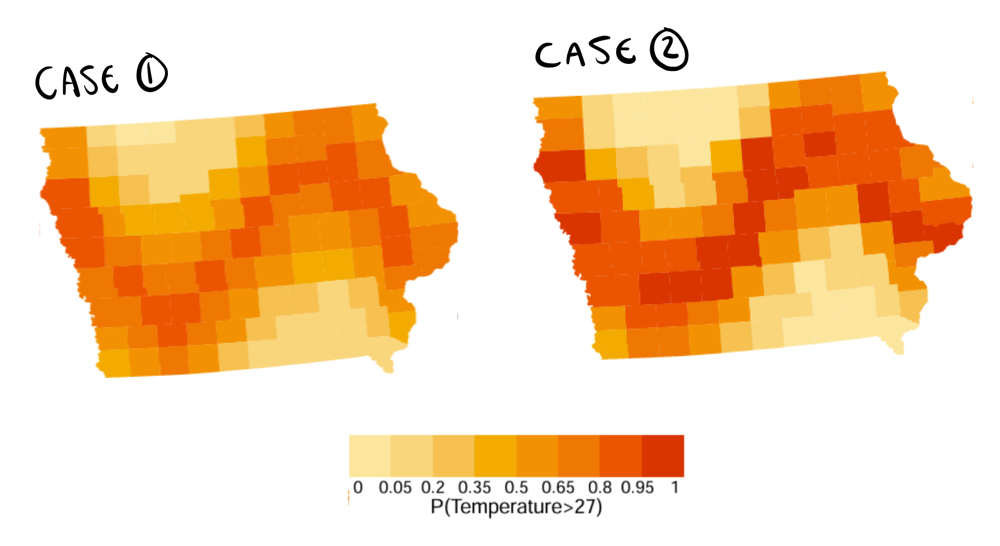
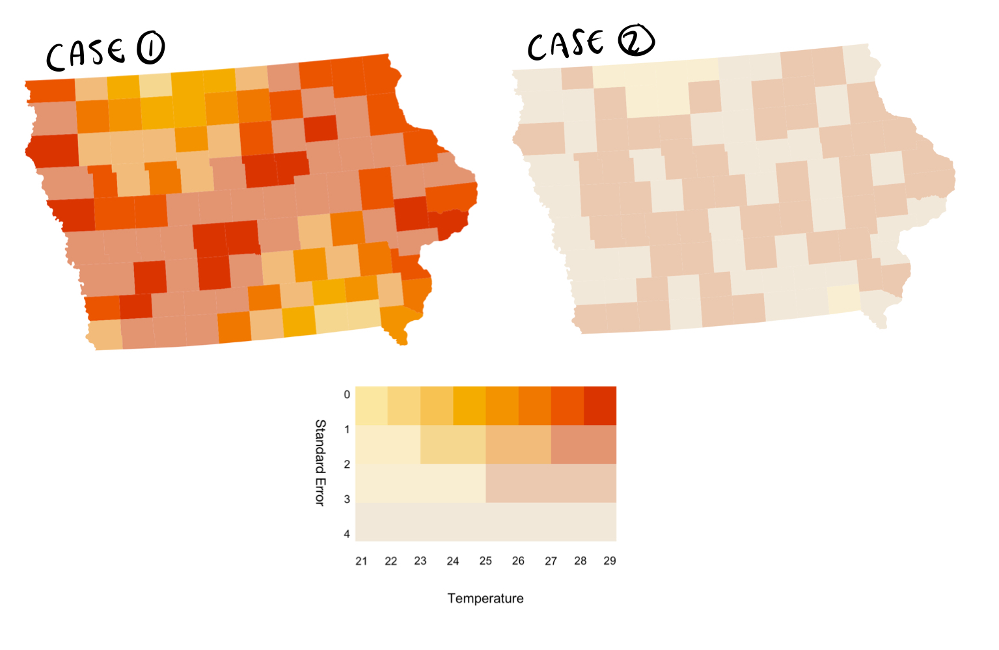
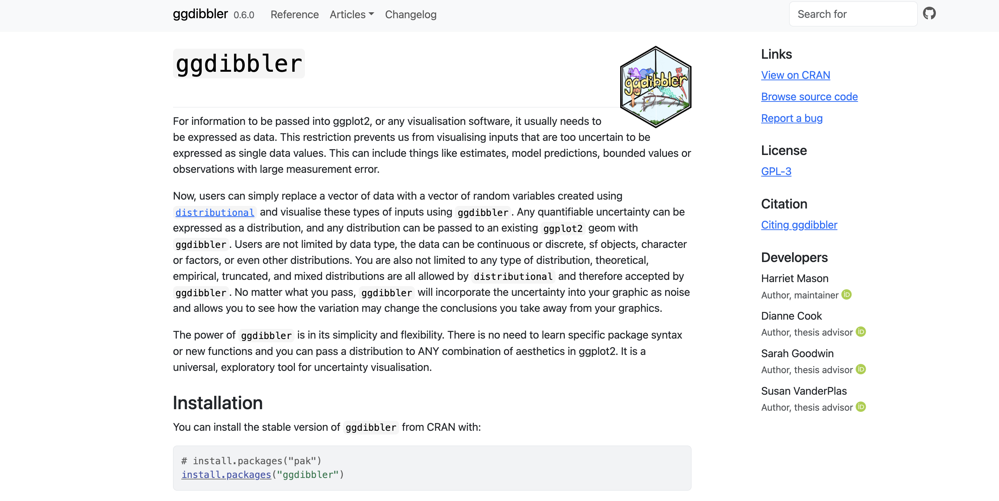

```{r setup}
#| include: false
#| message: false
#| warning: false

library(ggdibbler)
library(tidyverse)
library(colorspace)
library(sf)
library(ggthemes)
library(distributional)
library(patchwork)
library(kableExtra)
library(ggthemes)
# read in other data

theme_set( theme_gdocs() + 
             theme(aspect.ratio = 1, 
                   axis.text.x = element_text(angle = 35, 
                                              vjust = 1.05, 
                                              hjust=1),
                   palette.colour.continuous = gdocs_pal(),
                   palette.colour.discrete = gdocs_pal(),
             )
)
```


```{r walkdata}
#filtered_walk <- walkathon[which((walkathon$name %in% extra_walk$name)),]
filtered_walk <- walktober

# Read in extra walk and add in suburbs
extra_walk <- read.csv("extrawalktober.csv") |>
  mutate(suburb = ifelse(suburb == "Claython north", "Clayton", suburb),
         suburb = ifelse(suburb == "Clayton ", "Clayton", suburb),
         suburb = ifelse(suburb == "Mordi ", "Oakleigh", suburb),
         suburb = ifelse(suburb == "Oakleigh ", "Oakleigh", suburb),
         suburb = ifelse(suburb == "Langwarrin", "Mordialloc", suburb),
         suburb = ifelse(suburb == "Croydon", "Mordialloc", suburb))

suburbs <- strayr::read_absmap("suburb2021")
#required_subs <- unique(c(extra_walk$suburb))
my_suburbs <- suburbs |> 
  filter(state_name_2021 == "Victoria") |>
  mutate(suburb_name_2021 = str_remove(suburb_name_2021, " \\(Vic.\\)")) |>
  filter(between(cent_long, 144.8, 145.2),
         between(cent_lat, -38, -37.8)) |>
  #filter(suburb_name_2021 %in% required_subs) |>
  #select(c(suburb_name_2021, geometry)) |>
  rename("suburb" = "suburb_name_2021")

extra_walk <- extra_walk |>
  left_join(my_suburbs, by = "suburb")
# add team colours
extra_walk$team_colour <- c(sequential_hcl(4, palette = "Peach"),
  sequential_hcl(5, palette = "Blues")[1:4],
  sequential_hcl(6, palette = "Reds 3")[2:5],
  sequential_hcl(5, palette = "Greens")[1:4],
  sequential_hcl(4, palette = "Purp"),
  sequential_hcl(8, palette = "Heat")[3:6])

# clean data to just local suburbs
clean_walk <- filtered_walk |>
  left_join(extra_walk, by="name") |>
  mutate(steps_dist = dist_truncated(steps + 0.1*steps*dist_normal(bias_mu, bias_se), 0),
         date = as.Date(date, "%d/%m/%y")) |>
  group_by(name) |>
  mutate(cum_steps = cumsum(steps)) |>
  ungroup() |>
  filter(date <= as.Date("23/10/25", "%d/%m/%y")) |>
  na.omit()

suburb_walk <- clean_walk |>
  as.tibble() |>
  group_by(suburb) |>
  summarise(mean_steps = mean(steps + 0.1*bias_mu),
            se_steps = mean((steps*0.1)^2*bias_se),
            steps_dist = dist_normal(mean_steps, se_steps)) |> 
  left_join(my_suburbs, by = "suburb") |>
  select(c(suburb, steps_dist, mean_steps, geometry))

# plot 1: line plot
# ggplot(clean_walk, aes(x=date, y=cum_steps, 
#                        colour = team_colour, group=name)) +
#   geom_line() +
#   scale_colour_identity()

# plot 2: distribution
# ggplot(clean_walk, aes(x=steps, fill = team_colour,
#                        group=name)) +
#   geom_density(alpha=0.5) +
#   facet_wrap(~team) +
#   scale_fill_identity()


# ggplot(clean_walk, aes(x=height, y = steps, colour = team_colour)) +
#   geom_jitter() +
#   scale_fill_identity()

```

# The uncertainty visualisation problem

## Walktober {.smaller}

-   Our department had a walkathon in october where we all competed to see how many steps we could walk each day {fig-align="center"}

## Data quality angel

::::: columns
::: {.column width="60%"}
{fig-align="center"}
:::

::: {.column width="40%"}
Before the competition started, I searched up the most accurate and cost effective pedometer
:::
:::::

## Pedometer = bad {.smaller}

-   It turns out, pedometers are wildly inaccurate {fig-align="center"}


## Data quality demons {.smaller}

::::: columns
::: {.column width="60%"}
{fig-align="center"}
:::

::: {.column width="40%"}
-   It turns out I was the ONLY person concerned about data quality
-   We conducted a survey after walktober, to see if we could quantify the pedometer error
-   Turns out the measurement error was the least of my worries
:::
:::::

## Survey response

{fig-align="center"}

## Quantifiable vs unquantifiable uncertainty {.smaller}

-   I can incorporate pedometer error estimates into our analysis, I *CANNOT* work with completely falsified data
-   This is the difference between quantifiable vs unquantifiable uncertainty
-   We are going to try and quantify the uncertainty that we can quantify
    -   "Anything worth doing is worth doing poorly" - G. K. Chesterton

## Not an uncommon scenario

Often our data is....

-   Unavailable,
    -   e.g. anonymised data, measurement error, etc.
-   Non-deterministic
    -   e.g. bounded data, estimated values, etc.
-   or Theoretical
    -   e.g. estimates based on theory, latent variables, etc

## Can we store it as data? {.smaller}

::::: columns
::: {.column width="70%"}
```{r}
clean_walk|> 
  as_tibble() |>
  select(steps_dist, team, name) |>
  head(8) |>
  kbl()
```
:::

::: {.column width="30%"}
-   Vectorised random variables with `distributional`
-   They are truncated normally distributed random variables
-   This is some of Mitch's software, I am not going to explain it because Mitch is going to talk about it immediately after me

:::
:::::

## How many statisticans does it take to visualise a random variable {.smaller}

-   Even though we usually work with random variables, are unable to visualise them effectively
-   Our choice of error distribution might change the conclusion of our analysis in unexpected ways
-   Often our solution is to just ignore the inherrent uncertainty in our data

## The visualisation challenge {.smaller}
-   Our department decides to do a visualisation challenge of the walktober data


```{r}
#| fig-align: center

# Plot0A
p1 <- ggplot(my_suburbs) +
  geom_sf(data = suburb_walk, aes(geometry= geometry, fill = mean_steps)) +
  geom_sf(aes(geometry= geometry), fill=NA) +
  theme_map() +
  ggtitle("Average steps per day by Melbourne Suburb") + 
  labs(fill = "Average steps per day") +
  scale_fill_continuous_sequential(palette = "Magenta", rev = TRUE)

# plot 3A
p2 <- ggplot(clean_walk, aes(x=team, y = steps, fill = team_colour)) +
  geom_col() +
  scale_fill_identity() +
  ggtitle("Total steps per team, per person") +
  theme_few()

p1 + p2
```

## I dont want to ignore it
-   But I did all that reading about pedometers, so I would like to incorporate that uncertainty
-   But **how** do we incorporate it? What does it mean to **see** uncertainty?

## Uncertainty visualisation for signal supression

-   Statistical validity should translates to perceptual ease
    -   The higher the variance on an estimate, the harder that estimate is to extract from the plot

{fig-align="center"}


# Working out what works

## Spot the difference  {.smaller}
-   Maps of temperature in Iowa counties
-   I chose two error distributions, can you spot the difference?

{fig-align="center"}

## Exceedance probability map

{fig-align="center"}

- If you care about the uncertainty, visualise the uncertainty


## A terrible vet

{fig-align="center"}

## A terrible vet

{fig-align="center"}

## Uncertainty as signal vs noise {.smaller}

-   Uncertainty can play two roles in an analysis
    -   Sometimes it is used to hedge or dampen our conclusions on other statistics
    -   Sometimes it is a statistic of inference itself
-   A visualisation is a statistic which means, just like other statistics, we use them to draw inference
    -   If we want to draw inference on uncertainty: visualise uncertainty as signal
    -   If it is supposed to hedge our inference from the plot: it is noise
-   An exceedence probability map is fine if we want to draw inference on our uncertainty, but not fine if we were trying to hedge the original plot

## Solution: add an axis for uncertainty {.smaller}

{fig-align="center"}

-   2D palette is harder to read
-   Says: "We have a wave pattern, but it is uncertain"

## I keep getting scammed


## Why doesn't this work?

-   Uncertainty is not just another variable…
    -   It presents an interesting perceptual problem
-   Usually do not want variables to interfere with each other
    -   In uncertainty visualisation, the opposite is true


## Solution: blend the colours together! {.smaller}

{fig-align="center"}

-   Made signal harder to see... but maybe too hard?
-   Still have 2D Colour palette
-   Standard error at which to blend colours is made up


## Free yourself from the two variable approach

-   Realistically, we are trying add information back in that we just shouldn't have droppped
-   We need a more holistic apporach that doesn't allow us to pick and choose when and how we include uncertainty
-   Uncertainty visualisation doesn't have units of data, it has units of "random variables" so we should directly input random variables


## Solution: simulate a sample {.smaller}

::::: columns
::: {.column width="70%"}
{fig-align="center"}
:::

::: {.column width="30%"}
-   Made using Vizumap's pixelmap function
-   Gives the best overall understanding of our random variables
-   Not actually making any top level decisions, just letting the variance from the random variables carry through to the visual system
-   The signal seems harder to read
-   1D colour palette
:::
:::::

## But does it work?
- We did a study on to check if the visiblity of the signal aligns with standard hypothesis tests

::: {#fig-plotexample layout-ncol=2}


{fig-align="center"}


{fig-align="center"}
(Thank you Nick Tierney for the `ishihara` package)
:::

## Pixel maps and hypothesis tests
- Shockingly well

```{r}
# load simulated models
load("data/glmer_models.rda")
load("data/theoretical_models.rda")
# load("data/average_fit.rda")

name_distance <- function(string) {
  paste0("Distance: \n", string)
}

LINES <- c("T-test" = "longdash", "Moran's I" = "dotdash")
glmer_models |>
  filter(!D==0,
         plot_type %in% c("Choropleth", "Pixel")) |>
  mutate(line_id = interaction(plot_type, id)) |>
  ggplot(aes(x=V,  group = line_id)) +
  geom_line(aes(y = power_random, colour = plot_type), 
            linewidth=0.3, alpha=0.3) +
  geom_line(data = theoretical_models |>
              filter(!D==0, plot_type %in% c("Choropleth", "Pixel")) |>
              mutate(line_id = interaction(test, plot_type, correct_number)),
            aes(y=power_random, linetype = test),
            linewidth=0.3, colour = "black") +
  theme(legend.position="top", 
        legend.direction ="horizontal",
        text=element_text(size=10), 
        strip.text.x=element_text(size=8),
        strip.text.y=element_text(size=8),
        legend.text = element_text(size=8)) +
  guides(colour = "none") + 
  facet_grid(rows = vars(plot_type), cols = vars(D),
             labeller = labeller(D = name_distance)) +
  labs(x = "Standard Deviation", y = "Power",
       linetype = "Classical Test") +
  scale_linetype_manual(values = LINES) 

```

# Uncertainty visualisation in `ggdibbler`

## Universal application in `ggdibbler`

-   `ggdibbler` applies this concept to every plot and every aesthetic

{fig-align="center"}

## Universal application in `ggdibbler` {.smaller}
{fig-align="center"}


## `ggdibbler` also ensures your plots have nice statistical properties

::::: columns
::: {.column width="40%"}
-   Statistical properties are what differentiate us from the animals
:::

::: {.column width="60%"}
{fig-align="center"}
:::
:::::

## The relationship between ggplot2 and ggdibbler
- Visual Continuous mapping theorem

{fig-align="center"}

## The relationship between ggplot2 and ggdibbler

{fig-align="center"}

## Uncertain data sets
Every data set used in the `ggplot2` documentation has a `distributional` version in `ggdibbler`

- `diamonds` = `uncertain_diamonds`
- `mpg` = `uncertain_mpg`
- `mtcars` = `uncertain_mtcars`
- `faithful` = `uncertain_faithful`
- `economics`= `uncertain_economics`


## ggdibbler and ggplot2

- Every `geom` has a `geom_sample` counterpart...

::::: columns
::: {.column width="50%"}

```{=html}
<iframe width="780" height="500" src="https://ggplot2.tidyverse.org/reference/index.html#geoms" title="ggplot2"></iframe>
```

:::

::: {.column width="50%"}

```{=html}
<iframe width="780" height="500" src="https://harriet-mason.github.io/ggdibbler/reference/index.html#geoms" title="ggdibbler"></iframe>
```

:::
:::::


## Contour plots

::::: columns
::: {.column width="50%"}

```{r}
#| echo: true
#| fig-width: 4
ggplot(faithfuld, aes(waiting, eruptions, z = density)) + 
  ggtitle("ggplot2") +
  geom_contour() +
  theme(aspect.ratio = 1)

```

:::

::: {.column width="50%"}

```{r}
#| echo: true
#| fig-width: 4

ggplot(uncertain_faithfuld, aes(waiting, eruptions, z = density2))+
  ggtitle("ggdibbler") +
  geom_contour_sample(alpha=0.2)+
  theme(aspect.ratio = 1)

```

:::
:::::

## Text plots {.smaller}

```{r textdata}
#| echo: false
set.seed(10)
textdata <- expand_grid(x = c(1,2,3,4,5), y= c(1,2,3,4,5)) |>
  mutate(
    text_const = sample(c(TRUE, FALSE), 25, replace=TRUE),
    text_dist = dist_bernoulli(0.3 + 0.4*text_const),
    ) 
```

::::: columns
::: {.column width="50%"}

```{r}
#| echo: true
#| fig-width: 4
ggplot(textdata, aes(x=x, y=y)) +
  geom_text(aes(label = text_const), size=4) +
  theme_few() +
  ggtitle("ggplot2") +
  theme(aspect.ratio = 1, legend.position = "none") 

```

:::

::: {.column width="50%"}

```{r}
#| echo: true
#| fig-width: 4

ggplot(textdata, aes(x=x, y=y, lab = text_dist)) +
  geom_text_sample(aes(label = after_stat(lab)), 
                   size=4, alpha=1/30, times=30) +
  ggtitle("ggdibbler") +
  theme_few() +
  theme(aspect.ratio = 1, legend.position = "none") 

```

:::
:::::


## Raster Plots  {.smaller}

::::: columns
::: {.column width="50%"}

```{r}
#| echo: true
#| fig-width: 4
ggplot(faithfuld, aes(waiting, eruptions)) + 
  geom_raster(aes(fill = density)) +
  ggtitle("ggplot2")+
  theme(legend.position = "bottom")

```

:::

::: {.column width="50%"}

```{r}
#| echo: true
#| fig-width: 4

ggplot(uncertain_faithfuld, aes(waiting, eruptions)) + 
  geom_raster_sample(aes(fill = density2)) +
  ggtitle("ggdibbler more error")+
  theme(legend.position = "bottom")

```

:::
:::::


## Bar charts  {.smaller}

::::: columns
::: {.column width="50%"}

```{r}
#| echo: true
#| fig-width: 4
ggplot(mpg, aes(class)) + 
  geom_bar_sample(aes(fill = drv), 
                  position = "stack")+
  theme(legend.position="none")+
  ggtitle("stack")

```

:::

::: {.column width="50%"}

```{r}
#| echo: true
#| fig-width: 4

ggplot(uncertain_mpg, aes(class)) + 
  geom_bar_sample(aes(fill = drv),
                  position = "stack_dodge")+
  theme(legend.position="none")+
  ggtitle("stack_dodge")

```

:::
:::::

## Spatial Plots  {.smaller}

```{r spatialdata}
#| echo: false
# Make average summary of data
toy_temp_mean <- toy_temp |> 
  dplyr::group_by(county_name) |>
  summarise(temp_mean = mean(recorded_temp))
```

::::: columns
::: {.column width="50%"}

```{r}
#| echo: true
#| fig-width: 4
ggplot(toy_temp_mean) +
  geom_sf(aes(geometry=county_geometry, fill=temp_mean), linewidth=0.7) +
  scale_fill_distiller(palette = "OrRd") +
  labs(fill="temp")+
  ggtitle("ggplot2")+
  theme(legend.position = "bottom")

```

:::

::: {.column width="50%"}

```{r}
#| echo: true
#| fig-width: 4

toy_temp_dist |> 
  ggplot() + 
  geom_sf_sample(aes(geometry = county_geometry, fill=temp_dist), linewidth=0, times=50) + 
  geom_sf(aes(geometry = county_geometry), fill=NA, linewidth=0.7) +
  scale_fill_distiller(palette = "OrRd") +
  labs(fill="temp")+
  ggtitle("ggdibbler")+
  theme(legend.position = "bottom")
```

:::
:::::


## `ggdibbler` uses a unique nested position system!
- Allows you to manage the overplotting from the sample

```{r}
# ggplot IDENTITY
p1 <- ggplot(mpg, aes(class)) + 
  geom_bar_sample(aes(fill = drv), 
                  position = "identity", alpha=0.7)+
  theme_few() +
  theme(legend.position="none", aspect.ratio = 1) +
  ggtitle("ggplot2: identity")

# ggdibbler identity
p2 <- ggplot(uncertain_mpg, aes(class)) + 
  geom_bar_sample(aes(fill = drv), alpha=0.1,
                  position = "identity_identity")+
  theme_few() +
  theme(legend.position="none", aspect.ratio = 1)+
  ggtitle("identity_identity")

p3 <- ggplot(uncertain_mpg, aes(class)) + 
  geom_bar_sample(aes(fill = drv), alpha=0.7,
                  position = "identity_dodge")+
  theme_few() +
  theme(legend.position="none", aspect.ratio = 1)+
  ggtitle("identity_dodge")


# ggplot dodge
p5 <- ggplot(mpg, aes(class)) + 
  geom_bar_sample(aes(fill = drv), 
                  position = position_dodge(preserve="single"))+
  theme_few() +
  theme(legend.position="none", aspect.ratio = 1)+
  ggtitle("ggplot: dodge")

p6 <- ggplot(uncertain_mpg, aes(class)) + 
  geom_bar_sample(aes(fill = drv), alpha=0.1,
                  position = "dodge_identity")+
  theme_few() +
  theme(legend.position="none", aspect.ratio = 1)+
  ggtitle("dodge_identity")

p7 <- ggplot(uncertain_mpg, aes(class)) + 
  geom_bar_sample(aes(fill = drv), 
                  position = "dodge_dodge")+
  theme_few() +
  theme(legend.position="none", aspect.ratio = 1)+
  ggtitle("dodge_dodge")


# ggplot stack
p9 <- ggplot(mpg, aes(class)) + 
  geom_bar_sample(aes(fill = drv), 
                  position = "stack")+
  theme_few() +
  theme(legend.position="none", aspect.ratio = 1)+
  ggtitle("ggplot2: stack")


p10 <- ggplot(uncertain_mpg, aes(class)) + 
  geom_bar_sample(aes(fill = drv), alpha=0.1,
                  position = "stack_identity")+
  theme_few() +
  theme(legend.position="none", aspect.ratio = 1)+
  ggtitle("stack_identity")

p11 <- ggplot(uncertain_mpg, aes(class)) + 
  geom_bar_sample(aes(fill = drv),
                  position = "stack_dodge")+
  theme_few() +
  theme(legend.position="none", aspect.ratio = 1)+
  ggtitle("stack_dodge")


(p1 | p2 | p3 ) / (p5 | p6 | p7) / (p9 | p10 | p11)

```

## Required to maintain limiting properties

```{r dodgebarchart, fig.width=12, fig.height=4}

set.seed(10)
catdog <- tibble(
    DogOwner = sample(c(TRUE, FALSE), 25, replace=TRUE),
    CatOwner = sample(c(TRUE, FALSE), 25, replace=TRUE))

random_catdog <- catdog |>
  mutate(
    DogOwner = dist_bernoulli(0.1 + 0.8*DogOwner),
  )
    

p1 <- ggplot(catdog, aes(DogOwner)) + 
  geom_bar_sample(aes(fill = CatOwner), 
                  position = position_dodge(preserve="single"))+
  theme_few() +
  theme(legend.position="none", aspect.ratio = 1)+
  ggtitle("ggplot: dodge")


p2 <- ggplot(random_catdog, aes(DogOwner)) + 
  geom_bar_sample(aes(fill = CatOwner), times=30,
                  position = "dodge_dodge") +
  theme_few() +
  theme(legend.position="none", aspect.ratio = 1)+
  ggtitle("ggdibbler: dodge_dodge")

p3 <- ggplot(random_catdog, aes(DogOwner)) + 
  geom_bar_sample(aes(fill = CatOwner),  times=30,
                  position = position_dodge(preserve="single")) +
  theme_few() +
  theme(legend.position="none", aspect.ratio = 1)+
  ggtitle("ggdibbler: dodge")

p3 <- ggplot(random_catdog, aes(DogOwner)) + 
  geom_bar_sample(aes(fill = CatOwner),  times=30,
                  position = position_dodge(preserve="single")) +
  theme_few() +
  theme(legend.position="none", aspect.ratio = 1)+
  ggtitle("ggdibbler: dodge")

p1 | p3 | p2

```

## Can I pick any position adjstment?
- Also checked different position adjustments in experiment

::: {#fig-plotexample layout-ncol=2}

{fig-align="center"}

{fig-align="center"}

(Thank you Nick Tierney for the `ishihara` package)
:::

## All `ggdibbler` plots convey the same statistical information!
```{r}
glmer_models |>
  filter(!D==0,
         plot_type %in% c("Choropleth", "Pixel", "Transparency")) |>
  mutate(line_id = interaction(plot_type, id)) |>
  ggplot(aes(x=V,  group = line_id)) +
  geom_line(aes(y = power_random, colour = plot_type), 
            linewidth=0.3, alpha=0.3) +
  geom_line(data = theoretical_models |>
              filter(!D==0, plot_type %in% c("Choropleth", "Pixel", "Transparency")) |>
              mutate(line_id = interaction(test, plot_type, correct_number)),
            aes(y=power_random, linetype = test),
            linewidth=0.3, colour = "black") +
  theme(legend.position="top", 
        legend.direction ="horizontal",
        text=element_text(size=10), 
        strip.text.x=element_text(size=8),
        strip.text.y=element_text(size=8),
        legend.text = element_text(size=8)) +
  guides(colour = "none") + 
  facet_grid(rows = vars(plot_type), cols = vars(D),
             labeller = labeller(D = name_distance)) +
  labs(x = "Standard Deviation", y = "Power",
       linetype = "Classical Test") +
  scale_linetype_manual(values = LINES) 

```

## Back to walktober example

```{r}
# Plot0B
p3 <- ggplot(my_suburbs) +
  geom_sf_sample(data = suburb_walk, linewidth=0, times=100,
                 aes(geometry= geometry, fill = steps_dist)) +
  geom_sf(aes(geometry= geometry), fill=NA) +
  theme_map()  +
  ggtitle("Average steps per day by Melbourne Suburb") + 
  labs(fill = "Average steps per day") +
  scale_fill_continuous_sequential(palette = "Magenta", rev = TRUE)

# plot 3B
p4 <- ggplot(clean_walk, aes(x=team, y = steps_dist, fill = team_colour)) +
  geom_col_sample(times=50) +
  scale_fill_identity() +
  ggtitle("Total steps per team, per person") +
  theme_few()

p3 + p4
```

## Have a go yourself
{fig-align="center"}

## Future Plans

-   Future of the software
    -   multivariate distributions and other complex more complex joint distributions
    -   built out nested position system
    -   expand on the scales to accept more object types
-   Unemployment
    -   I also need a job (I am holding my software hostage)
    -   If you want to give me a job, my email is harriet.m.mason\@gmail.com

## Acknowledgements
-   My Supervisors: Di Cook, Susan Vanderplas, and Sarah Goodwin
-   AEMO Zema Energy Schoalarship
-   Australian RTP Stipend
-   Numbat Hackathon (for the walktober data)
-   Mitch O'Hara-Wild and Cynthia Huang
