- FORMAT
- drawings
  - minds eye
  - github mania
  - teeny tiny project
  - don't speak to me about spatial uncertainty
1. Motivating example (walktober)
2. What are we shooting for? (theory and code)
3. A teeny tiny spatial example (and experiment)
4. Mania and ggdibbler

```{r setup}
#| include: false
#| message: false
#| warning: false

library(ggdibbler)
library(tidyverse)
library(colorspace)
library(sf)
library(ggthemes)
library(distributional)
library(patchwork)
library(kableExtra)
library(ggthemes)
# read in other data

theme_set( theme_gdocs() + 
             theme(aspect.ratio = 1, 
                   axis.text.x = element_text(angle = 35, 
                                              vjust = 1.05, 
                                              hjust=1),
                   palette.colour.continuous = gdocs_pal(),
                   palette.colour.discrete = gdocs_pal(),
             )
)
gpal <- gdocs_pal()(5)
```


```{r walkdata}
#filtered_walk <- walkathon[which((walkathon$name %in% extra_walk$name)),]
filtered_walk <- walktober

# Read in extra walk and add in suburbs
extra_walk <- read.csv("extrawalktober.csv") |>
  mutate(suburb = ifelse(suburb == "Claython north", "Clayton", suburb),
         suburb = ifelse(suburb == "Clayton ", "Clayton", suburb),
         suburb = ifelse(suburb == "Mordi ", "Oakleigh", suburb),
         suburb = ifelse(suburb == "Oakleigh ", "Oakleigh", suburb),
         suburb = ifelse(suburb == "Langwarrin", "Mordialloc", suburb),
         suburb = ifelse(suburb == "Croydon", "Mordialloc", suburb))

suburbs <- strayr::read_absmap("suburb2021")
#required_subs <- unique(c(extra_walk$suburb))
my_suburbs <- suburbs |> 
  filter(state_name_2021 == "Victoria") |>
  mutate(suburb_name_2021 = str_remove(suburb_name_2021, " \\(Vic.\\)")) |>
  filter(between(cent_long, 144.8, 145.2),
         between(cent_lat, -38, -37.8)) |>
  #filter(suburb_name_2021 %in% required_subs) |>
  #select(c(suburb_name_2021, geometry)) |>
  rename("suburb" = "suburb_name_2021")

extra_walk <- extra_walk |>
  left_join(my_suburbs, by = "suburb")
# add team colours
extra_walk$team_colour <- c(sequential_hcl(4, palette = "Peach"),
  sequential_hcl(5, palette = "Blues")[1:4],
  sequential_hcl(6, palette = "Reds 3")[2:5],
  sequential_hcl(5, palette = "Greens")[1:4],
  sequential_hcl(4, palette = "Purp"),
  sequential_hcl(8, palette = "Heat")[3:6])

# clean data to just local suburbs
clean_walk <- filtered_walk |>
  left_join(extra_walk, by="name") |>
  mutate(steps_dist = dist_truncated(steps + 0.1*steps*dist_normal(bias_mu, bias_se), 0),
         date = as.Date(date, "%d/%m/%y")) |>
  group_by(name) |>
  mutate(cum_steps = cumsum(steps)) |>
  ungroup() |>
  filter(date <= as.Date("23/10/25", "%d/%m/%y")) |>
  na.omit()

suburb_walk <- clean_walk |>
  as.tibble() |>
  group_by(suburb) |>
  summarise(mean_steps = mean(steps + 0.1*bias_mu),
            se_steps = mean((steps*0.1)^2*bias_se),
            steps_dist = dist_normal(mean_steps, se_steps)) |> 
  left_join(my_suburbs, by = "suburb") |>
  select(c(suburb, steps_dist, mean_steps, geometry))

# plot 1: line plot
# ggplot(clean_walk, aes(x=date, y=cum_steps, 
#                        colour = team_colour, group=name)) +
#   geom_line() +
#   scale_colour_identity()

# plot 2: distribution
# ggplot(clean_walk, aes(x=steps, fill = team_colour,
#                        group=name)) +
#   geom_density(alpha=0.5) +
#   facet_wrap(~team) +
#   scale_fill_identity()


# ggplot(clean_walk, aes(x=height, y = steps, colour = team_colour)) +
#   geom_jitter() +
#   scale_fill_identity()

```


#Part 1: A Motivating Example

## Walktober {.smaller}

-   Our department had a walkathon in october where we all competed to see how many steps we could walk each day 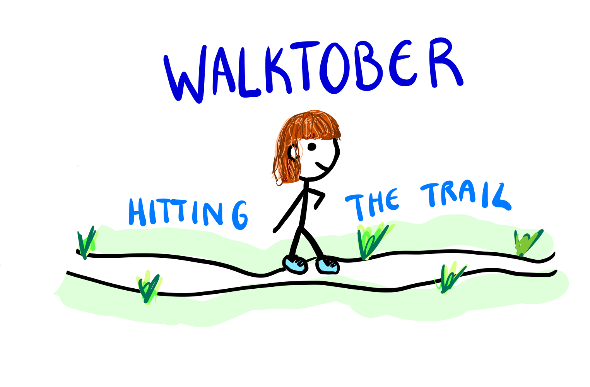{fig-align="center"}

## Data quality angel

::::: columns
::: {.column width="60%"}
{fig-align="center"}
:::

::: {.column width="40%"}
Before the competition started, I searched up the most accurate and cost effective pedometer
:::
:::::

## Pedometer = bad {.smaller}

-   It turns out, pedometers are wildly inaccurate {fig-align="center"}


## Data quality demons {.smaller}

::::: columns
::: {.column width="60%"}
{fig-align="center"}
:::

::: {.column width="40%"}
-   It turns out I was the ONLY person concerned about data quality
-   We conducted a survey after walktober, to see if we could quantify the pedometer error
-   Turns out the measurement error was the least of my worries
:::
:::::

## Survey response

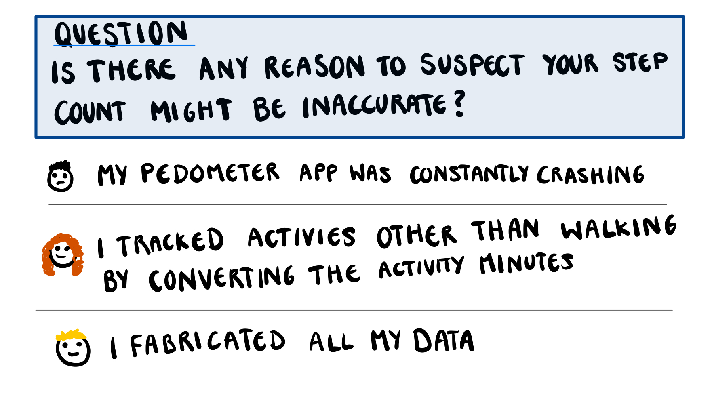{fig-align="center"}

## Quantifiable vs unquantifiable uncertainty {.smaller}

-   I can incorporate pedometer error estimates into our analysis, I *CANNOT* work with completely falsified data
-   This is the difference between quantifiable vs unquantifiable uncertainty
-   We are going to try and quantify the uncertainty that we can quantify
    -   "Anything worth doing is worth doing poorly" - G. K. Chesterton


## Ignoring the error {.smaller}
-   Our department decides to do a visualisation challenge of the walktober data


```{r}
#| fig-align: center

# Plot0A
p1 <- ggplot(my_suburbs) +
  geom_sf(data = suburb_walk, aes(geometry= geometry, fill = mean_steps)) +
  geom_sf(aes(geometry= geometry), fill=NA) +
  theme_map() +
  ggtitle("Average steps per day by Melbourne Suburb") + 
  labs(fill = "Average steps per day") +
  scale_fill_continuous_sequential(palette = "Magenta", rev = TRUE)

# plot 3A
p2 <- ggplot(clean_walk, aes(x=team, y = steps, fill = team_colour)) +
  geom_col() +
  scale_fill_identity() +
  ggtitle("Total steps per team, per person") +
  theme_few()

p1 + p2
```

## Not an uncommon scenario

Often our data is....

-   Unavailable,
    -   e.g. anonymised data, measurement error, etc.
-   Non-deterministic
    -   e.g. bounded data, estimated values, etc.
-   or Theoretical
    -   e.g. estimates based on theory, latent variables, etc


## Visual statistical properties

::::: columns
::: {.column width="40%"}
-   Statistical properties are what differentiate us from the animals
-   What does it mean to **see** this uncertainty?
:::

::: {.column width="60%"}
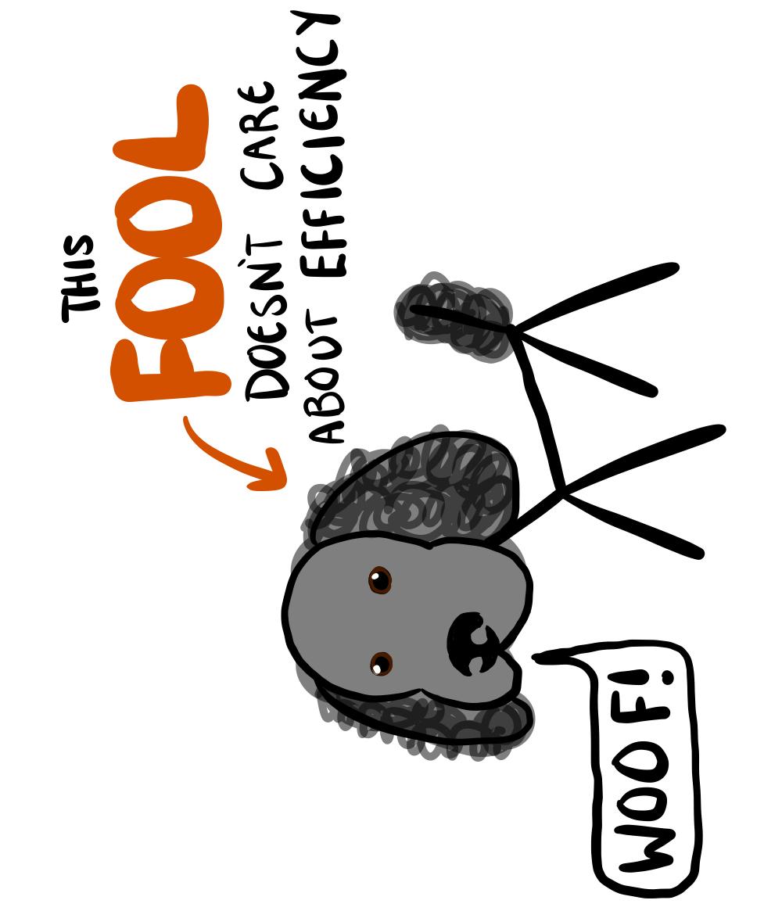{fig-align="center"}
:::
:::::

## Broad goals of the system
-   Statistical validity should translates to perceptual ease
    -   The higher the variance on an estimate, the harder that estimate is to extract from the plot

{fig-align="center"}


# Part 2: A Teeny Tiny Spatial Example

## My specific problem
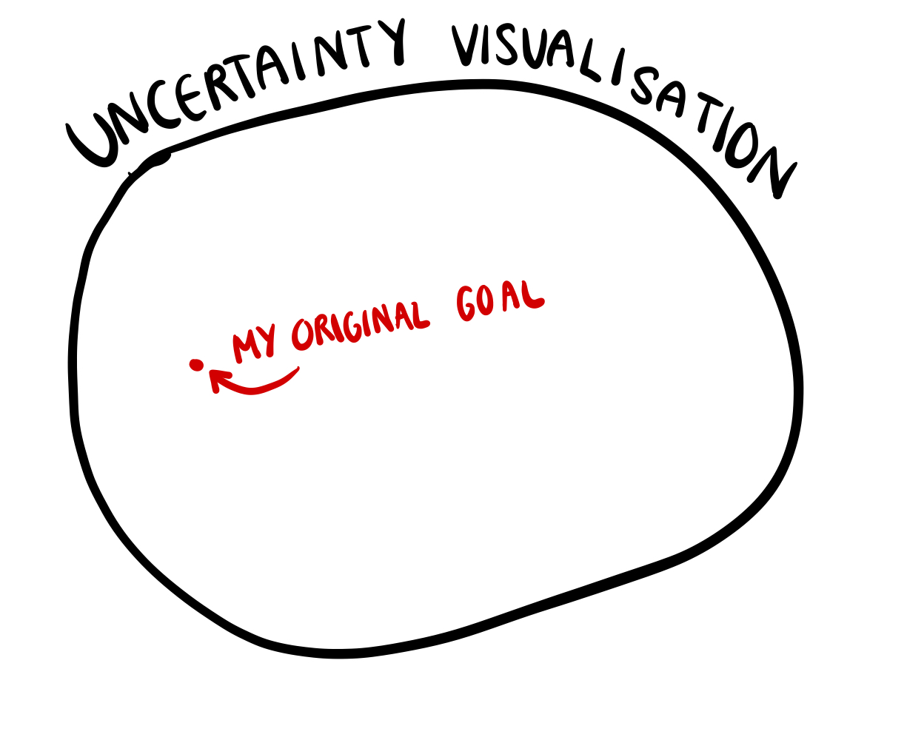{fig-align="center"}

```{r maps}
# get data
load("data/my_map_data.rda")

# seed for sampling
set.seed(1997)

# data dimension for sampling
n <- dim(my_map_data)[1]

# Make palettes
longpal <- rev(sequential_hcl(13, palette = "YlOrRd"))
basecols <- longpal[3:10]
breaks <- 21:29 
breakslong <- 18:32 
names(basecols) <- seq(8)
names(longpal) <- -1:11
var_seq <- seq(0,12, by=3)

my_map_data <- my_map_data |>
  mutate(temp = 29 - 2*abs(scale(cent_lat) - sin(2*(scale(cent_long)))[,1]), # trend
         highvar = runif(n, min=8, max=var_seq[5]), # high variance
         lowvar = runif(n, min=2, max=4), # low variance
         count_id = row_number()) |>
  pivot_longer(cols=highvar:lowvar, names_to = "variance_class", values_to = "variance") |>
  # add bivariate classes to data
  mutate(bitemp = cut(temp, breaks=breaks, labels=seq(8)),
         bivar = cut(variance, breaks=var_seq, labels=seq(4)),
         biclass = paste(bitemp, bivar, sep="-")) |>
  mutate(highlight = ifelse(count_id <= 5, TRUE, FALSE)) |>
  mutate(temp = as.numeric(temp))

###################### CHOROPLETH MAP ###################### 
choro1 <- my_map_data |>
  filter(variance_class=="lowvar") |>
  ggplot() +
  geom_sf(aes(fill = temp, 
              geometry = geometry), colour=NA) + 
  scale_fill_gradientn(colours = basecols) +
  #theme_void() +
  labs(fill = "temperature") +
  theme_map() +
  theme(legend.position = "inside", 
        legend.position.inside = c(0.1, -0.2),
        legend.direction = "horizontal",
        legend.background = element_rect(fill=NA),
        plot.title = element_text(size = 14)) + 
  ggtitle("Low Varince") 

choro2 <- choro1 %+% filter(my_map_data, variance_class=="highvar") +
  ggtitle("High Variance") 

######################  Exceed Prob Map ######################  

exeed_data <- my_map_data |> 
  as_tibble() |>
  mutate(xprob = 1- pnorm(27, mean=temp, sd=variance)) 
             
exceed1 <- exeed_data |>
  filter(variance_class=="lowvar") |>
  ggplot() +
  geom_sf(aes(fill = xprob, 
              geometry = geometry), colour=NA) + 
  scale_fill_gradientn(colours = basecols, limits=c(0,1)) +
  #theme_void() +
  labs(fill = "P(X>27)") +
  theme_map() +
  theme(legend.position = "inside", 
        legend.position.inside = c(0.1, -0.2),
        legend.direction = "horizontal",
        legend.background = element_rect(fill=NA),
        plot.title = element_text(size = 14)) +   
  ggtitle("Low Variance") 

exceed2 <- exceed1 %+% filter(exeed_data, variance_class=="highvar") + 
  ggtitle("High Variance") 

####################### Bivariate maps ###################### 

# Make bivariate palette
# Function to devalue by a certain amount
colsupress <- function(basecols, hue=1, sat=1, val=1) {
    X <- diag(c(hue, sat, val)) %*% rgb2hsv(col2rgb(basecols))
    hsv(pmin(X[1,], 1), pmin(X[2,], 1), pmin(X[3,], 1))
}

# recursively decrease value
v_val = 0.5
bivariatepal <- c(basecols,
                  colsupress(basecols, sat=v_val),
                  colsupress(colsupress(basecols, sat=v_val), sat=v_val),
                  colsupress(colsupress(colsupress(basecols, sat=v_val), sat=v_val), sat=v_val))
# establish levels of palette
names(bivariatepal) <- paste(rep(1:8, 4), "-" , rep(1:4, each=8), sep="")

# mapping
bivar1 <- my_map_data |>
  filter(variance_class=="lowvar") |>
  ggplot() +
  geom_sf(aes(fill = biclass, geometry = geometry), colour=NA) + 
  scale_fill_manual(values = bivariatepal) +
  theme_void() + 
  theme(legend.position = "none") +
  ggtitle("Low Variance") 
  
bivar2 <- bivar1 %+% filter(my_map_data, variance_class=="highvar") +
  ggtitle("High Variance") 


bivar_pal<- expand_grid(bitemp = seq(1,8), bivar = seq(1,4)) |>
  mutate(biclass = paste(bitemp, bivar, sep="-"))

bivar3 <- bivar_pal |>
  ggplot(aes(x=bitemp, y=bivar, fill=biclass)) +
  geom_tile() +
  scale_fill_manual(values = bivariatepal) +
  theme_classic() +
  theme(aspect.ratio=0.2) + 
  scale_x_continuous(breaks = c(1,2,3,4,5,6,7,8),
                     expand=c(0,0)) +
  scale_y_reverse(breaks = c(0,1,2,3,4),
                  labels = c(0,3,6,9,12)) + 
  labs(x = "temperature",
       y = "SE") +
  theme(aspect.ratio = 0.55, legend.position = "none",
        axis.line = element_blank(),
        axis.ticks = element_blank()) 

#bivar1 <- bivar1 / bivar3
#bivar2 <- bivar2 / bivar3
# bivar1 <- bivar1 + bivar3 + plot_layout(ncol=1, heights = c(4, 1))
# bivar2 <- bivar2 + bivar3 + plot_layout(ncol=1, heights = c(4, 1))

bivar1 <-  bivar1 + inset_element(bivar3, left = -0.01, bottom = -0.5, 
                          right = 0.4, top = 0.2)

bivar2 <-  bivar2 + inset_element(bivar3, left = -0.01, bottom = -0.5, 
                          right = 0.4, top = 0.2)

####################### VSUP maps ###################### 
# Function to combine colours for VSUP
colourblend <- function(basecols, p_length, nblend) {
    X <- rgb2hsv(col2rgb(unique(basecols)))
    v1 <- X[,seq(1,dim(X)[2], 2)]
    v2 <- X[,seq(2,dim(X)[2], 2)]
    if("matrix" %in% class(v1)){
      # hue issue wrap around pt 1
      v3 <- (v1+v2)
      v3["h",] <- ifelse(abs(v1["h",]-v2["h",])>0.5, v3["h",]+1, v3["h",])
      v3 <- v3/2
      # hue issue wrap around pt 2
      v3["h",] <- ifelse(v3["h",]>=1 , v3["h",]-1 ,v3["h",])
      hsv(rep(v3[1,], each=nblend), rep(v3[2,], each=nblend), rep(v3[3,], each=nblend))
      } else {
        v3 <- (v1+v2)
        v3["h"] <- ifelse(abs(v1["h"]-v2["h"])>0.5, v3["h"]+1, v3["h"])
        v3 <- v3/2
        v3["h"] <- ifelse(v3["h"]>=1 , v3["h"]-1 ,v3["h"])
        rep(hsv(h=v3[1], s=v3[2], v=v3[3]), p_length)
        }
}

VSUPfunc <- function(basecols, p_length, nblend){
  colourblend(colsupress(basecols, sat=0.5), p_length, nblend)
}

# VSUP
p = length(basecols)
VSUP <- c(basecols,
          VSUPfunc(basecols, p, 2),
          VSUPfunc(VSUPfunc(basecols, p, 2), p, 4),
          VSUPfunc(VSUPfunc(VSUPfunc(basecols, p, 2), p, 4), p, 8))

names(VSUP) <- paste(rep(1:8, 4), "-" , rep(1:4, each=8), sep="")

# VSUP maps
vsup1 <- my_map_data |>
  filter(variance_class=="lowvar") |>
  ggplot() +
  geom_sf(aes(fill = biclass, geometry = geometry), colour=NA) + 
  scale_fill_manual(values = VSUP) +
  theme_void() + 
  theme(legend.position = "none") +
  ggtitle("Low Variance...?")

fake_data <- my_map_data |>
  filter(variance_class=="lowvar") |>
  mutate(bivar = cut(variance, breaks=c(0,1,2,3,4), labels=seq(4)), 
         biclass = paste(bitemp, bivar, sep="-"))

vsup2 <- vsup1 %+% fake_data +
  ggtitle("High Variance...?")
#  annotate("text", x = 306000, y = -140000, label = "B", size = 5)
# vsup1 <- vsup1 + 
#   annotate("text", x = 306000, y = -140000, label = "A", size = 5) 

fake_data <- my_map_data |>
  filter(variance_class=="lowvar") |>
  mutate(bivar = cut(variance, breaks=c(0,1,2,3,4), labels=seq(4)),
         biclass = paste(bitemp, bivar, sep="-"))


vsup3 <- bivar3 + scale_fill_manual(values = VSUP)

vsup4 <- vsup3 + 
  scale_y_reverse(breaks = c(0,1,2,3,4),
                  labels = c(0,1,2,3,4))

#vsup1 <- vsup1 / vsup3
#vsup2 <- vsup2 / vsup4
# vsup1 <- vsup1 + vsup3 + plot_layout(ncol=1, heights = c(4, 1))
# vsup2 <- vsup2 + vsup4 + plot_layout(ncol=1, heights = c(4, 1))

vsup1 <- vsup1 + inset_element(vsup3, left = -0.01, bottom = -0.5, 
                          right = 0.4, top = 0.2)

vsup2 <- vsup2 + inset_element(vsup4, left = -0.01, bottom = -0.5, 
                          right = 0.4, top = 0.2)

####################### Pixel maps ######################
# low variance
pixel1 <- my_map_data |>
  filter(variance_class=="lowvar") |>
  ggplot() +
  geom_sf_sample(aes(fill = dist_normal(temp, variance), 
              geometry = geometry), colour=NA, times=30) + 
  #theme_void() + 
  scale_fill_gradientn(colours = longpal) +
  labs(fill = "temperature") +
  theme_map() +
  theme(legend.position = "inside", 
        legend.position.inside = c(0.1, -0.2),
        legend.direction = "horizontal",
        legend.background = element_rect(fill=NA),
        plot.title = element_text(size = 14)) +   
  ggtitle("Low Variance") 

# high variance
pixel2 <- my_map_data |>
  filter(variance_class=="highvar") |>
  ggplot() +
  geom_sf_sample(aes(fill = dist_normal(temp, variance), 
              geometry = geometry), colour=NA, times=30) + 
  scale_fill_gradientn(colours = longpal) +
  #theme_void() +
  labs(fill = "temperature") +
  theme_map() +
  theme(legend.position = "inside", 
        legend.position.inside = c(0.1, -0.2),
        legend.direction = "horizontal",
        legend.background = element_rect(fill=NA),
        plot.title = element_text(size = 14)) +   
  ggtitle("High Variance") 
```


## Spot the difference  {.smaller}
-   Maps of temperature in Iowa counties

```{r}
choro1 + choro2  
```

## Does it work?
- Probably not (since it is the whole reason we are doing this)
- How do test?
- Made a fake colour blind test using Nick Tierney's `ishihara` package


## Does it work?
{fig-align="center"}

```{r}
# load simulated models
load("data/glmer_models.rda")
load("data/theoretical_models.rda")
# load("data/average_fit.rda")

name_distance <- function(string) {
  paste0("Distance: \n", string)
}

LINES <- c("T-test" = "longdash", "Moran's I" = "dotdash")

map_type = "Choropleth"
pcol = gpal[1]

glmer_models |>
  filter(!D==0,
         plot_type %in% map_type) |>
  mutate(line_id = interaction(plot_type, id)) |>
  ggplot(aes(x=V,  group = line_id)) +
  geom_line(aes(y = power_random), colour = pcol,
            linewidth=0.3, alpha=0.3) +
  geom_line(data = theoretical_models |>
              filter(!D==0, plot_type %in% map_type) |>
              mutate(line_id = interaction(test, plot_type, correct_number)),
            aes(y=power_random, linetype = test),
            linewidth=0.3, colour = "black") +
  theme(legend.position="top", 
        legend.direction ="horizontal",
        text=element_text(size=10), 
        strip.text.x=element_text(size=8),
        strip.text.y=element_text(size=8),
        legend.text = element_text(size=8)) +
  guides(colour = "none") + 
  facet_grid(rows = vars(plot_type), cols = vars(D),
             labeller = labeller(D = name_distance)) +
  labs(x = "Standard Deviation", y = "Power",
       linetype = "Classical Test") +
  scale_linetype_manual(values = LINES) 

```

## Solution: add an axis for uncertainty {.smaller}
```{r}
bivar1 + bivar2 
```

-  "We have a wave pattern, but it is uncertain"


## Does it work?
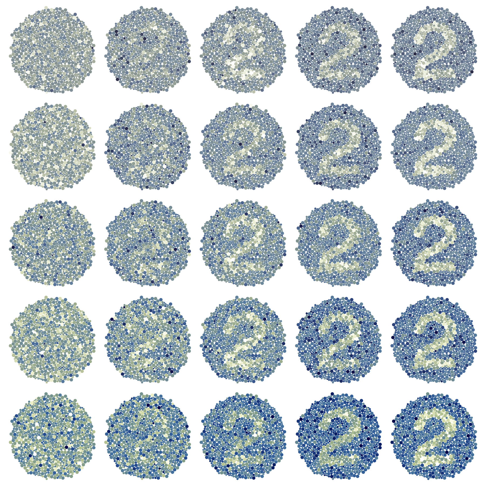{fig-align="center"}

```{r}
map_type = "Bivariate"
pcol = gpal[2]

glmer_models |>
  filter(!D==0,
         plot_type %in% map_type) |>
  mutate(line_id = interaction(plot_type, id)) |>
  ggplot(aes(x=V,  group = line_id)) +
  geom_line(aes(y = power_random), colour = pcol,
            linewidth=0.3, alpha=0.3) +
  geom_line(data = theoretical_models |>
              filter(!D==0, plot_type %in% map_type) |>
              mutate(line_id = interaction(test, plot_type, correct_number)),
            aes(y=power_random, linetype = test),
            linewidth=0.3, colour = "black") +
  theme(legend.position="top", 
        legend.direction ="horizontal",
        text=element_text(size=10), 
        strip.text.x=element_text(size=8),
        strip.text.y=element_text(size=8),
        legend.text = element_text(size=8)) +
  guides(colour = "none") + 
  facet_grid(rows = vars(plot_type), cols = vars(D),
             labeller = labeller(D = name_distance)) +
  labs(x = "Standard Deviation", y = "Power",
       linetype = "Classical Test") +
  scale_linetype_manual(values = LINES) 

```

## Why doesn't this work?

-   Uncertainty is not just another variable…
    -   It presents an interesting perceptual problem
-   Usually do not want variables to interfere with each other
    -   In uncertainty visualisation, the opposite is true


## Solution: blend the colours together! {.smaller}

```{r}
vsup1 + vsup2  
```

## Does it work?
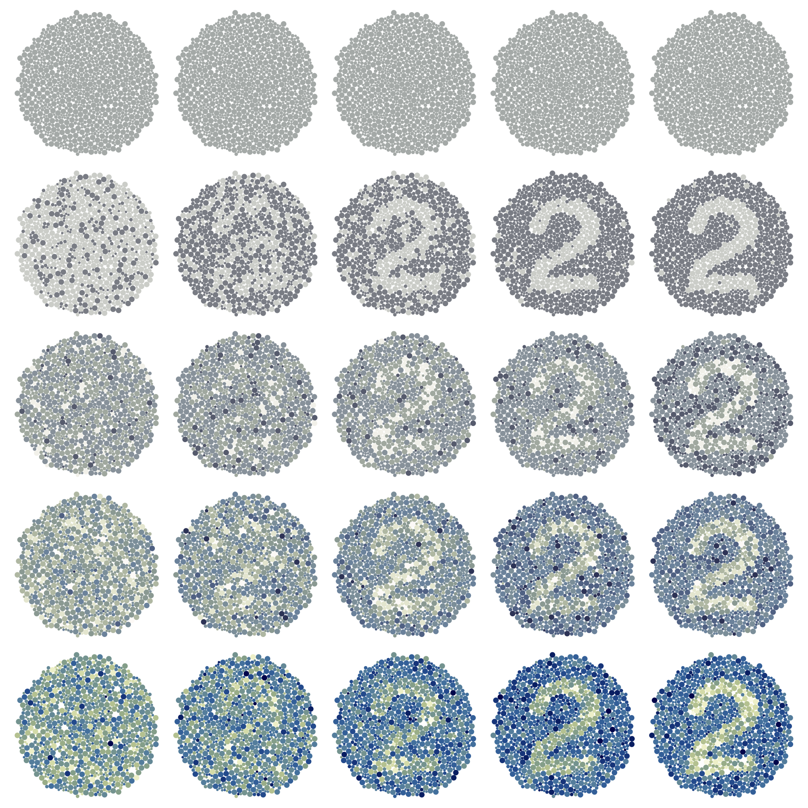{fig-align="center"}

```{r}
map_type = "VSUP"
pcol = gpal[3]

glmer_models |>
  filter(!D==0,
         plot_type %in% map_type) |>
  mutate(line_id = interaction(plot_type, id)) |>
  ggplot(aes(x=V,  group = line_id)) +
  geom_line(aes(y = power_random), colour = pcol,
            linewidth=0.3, alpha=0.3) +
  geom_line(data = theoretical_models |>
              filter(!D==0, plot_type %in% map_type) |>
              mutate(line_id = interaction(test, plot_type, correct_number)),
            aes(y=power_random, linetype = test),
            linewidth=0.3, colour = "black") +
  theme(legend.position="top", 
        legend.direction ="horizontal",
        text=element_text(size=10), 
        strip.text.x=element_text(size=8),
        strip.text.y=element_text(size=8),
        legend.text = element_text(size=8)) +
  guides(colour = "none") + 
  facet_grid(rows = vars(plot_type), cols = vars(D),
             labeller = labeller(D = name_distance)) +
  labs(x = "Standard Deviation", y = "Power",
       linetype = "Classical Test") +
  scale_linetype_manual(values = LINES) 

```

## Free yourself from the two variable approach

-   Realistically, we are trying add information back in that we just shouldn't have droppped
-   We need a more holistic apporach that doesn't allow us to pick and choose when and how we include uncertainty
-   Uncertainty visualisation doesn't have units of data, it has units of "random variables" so we should directly input random variables


## Solution: simulate a sample {.smaller}

```{r}
pixel1 + pixel2  
```

## Does it work?
{fig-align="center"}

```{r}
map_type = "Pixel"
pcol = gpal[4]

glmer_models |>
  filter(!D==0,
         plot_type %in% map_type) |>
  mutate(line_id = interaction(plot_type, id)) |>
  ggplot(aes(x=V,  group = line_id)) +
  geom_line(aes(y = power_random), colour = pcol,
            linewidth=0.3, alpha=0.3) +
  geom_line(data = theoretical_models |>
              filter(!D==0, plot_type %in% map_type) |>
              mutate(line_id = interaction(test, plot_type, correct_number)),
            aes(y=power_random, linetype = test),
            linewidth=0.3, colour = "black") +
  theme(legend.position="top", 
        legend.direction ="horizontal",
        text=element_text(size=10), 
        strip.text.x=element_text(size=8),
        strip.text.y=element_text(size=8),
        legend.text = element_text(size=8)) +
  guides(colour = "none") + 
  facet_grid(rows = vars(plot_type), cols = vars(D),
             labeller = labeller(D = name_distance)) +
  labs(x = "Standard Deviation", y = "Power",
       linetype = "Classical Test") +
  scale_linetype_manual(values = LINES) 

```

# Part 3: Making the ggplot2 extension

## `Vizumap` code
- Works? Yes. Code from my minds eye? No.
```{r}
#| eval: false
#| echo: true

# load the package
library(Vizumap)
library(sf)
sf_use_s2(FALSE)

# Step 1: Format data using bespoke data formatting function
data <- read.uv(data = original_data, 
                estimate = "mean", 
                error = "standard_error")

# Step 2: Pixelate the shapefile
pixelation <- pixelate(geoData = geometry_data, 
                       id = "ID", 
                       # improved - set number of pixels
                       pixelSize = 100)


# Step 3: Build pixel map
pixel_map <- build_pmap(data = data, 
                         distribution = "normal", 
                         pixelGeo = pixelation, 
                         id = "ID", 
                         # You can only use a set palette
                         palette = "Oranges",
                         border = geometry_data)

# Step 4: Print pixel map
view(pixel_map)
```

## Code from my minds eye
```{r}
#| echo: true
#| eval: false

ggplot(map_data) +
  geom_sf(aes(geometry = geometry, fill = random_variable))

```

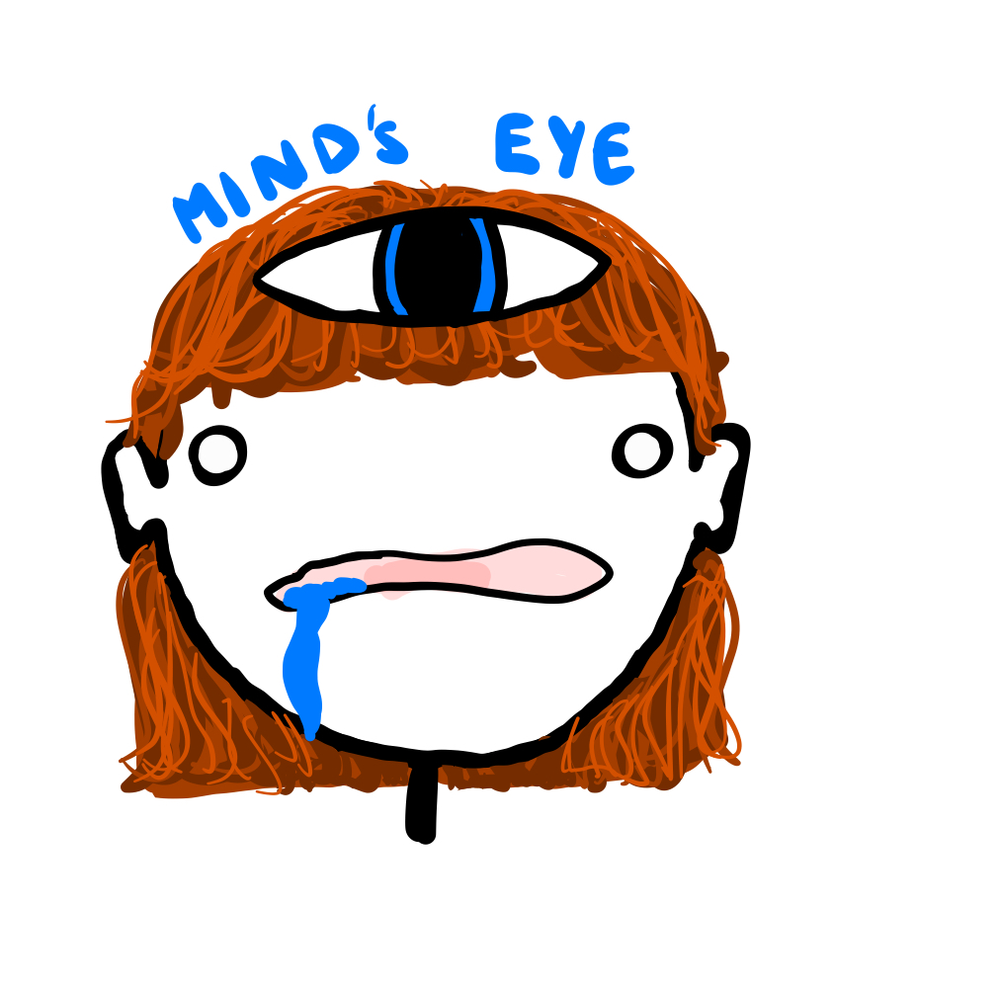{fig-align="center"}

## `distributional`: distributions as data {.smaller}

::::: columns
::: {.column width="70%"}
```{r}
clean_walk|> 
  as_tibble() |>
  select(steps_dist, team, name) |>
  head(8) 
```
:::

::: {.column width="30%"}
-   Vectorised random variables with `distributional`
  -   Thank you Mitch, Matt, Alex,  and Rob
-   Our walktober example as trunacted normal distributions
-   This is not a talk on `distributional` 

:::
:::::

## Simple problem
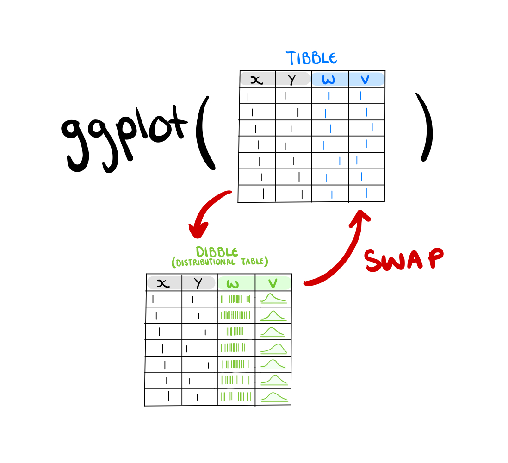{fig-align="center"}

## Good noodle, listen to ggplot2 book
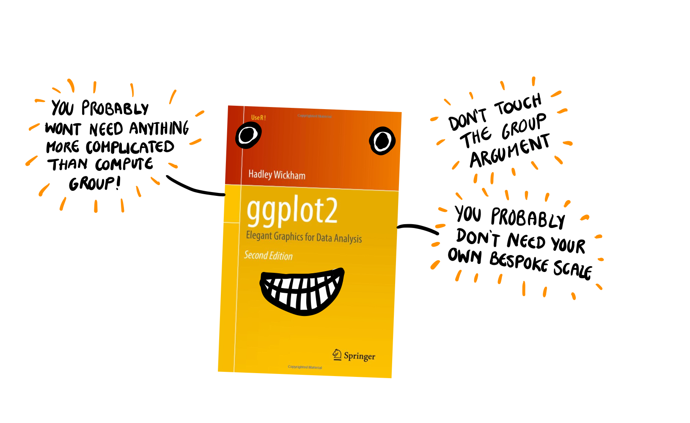{fig-align="center"}

## The scale problem
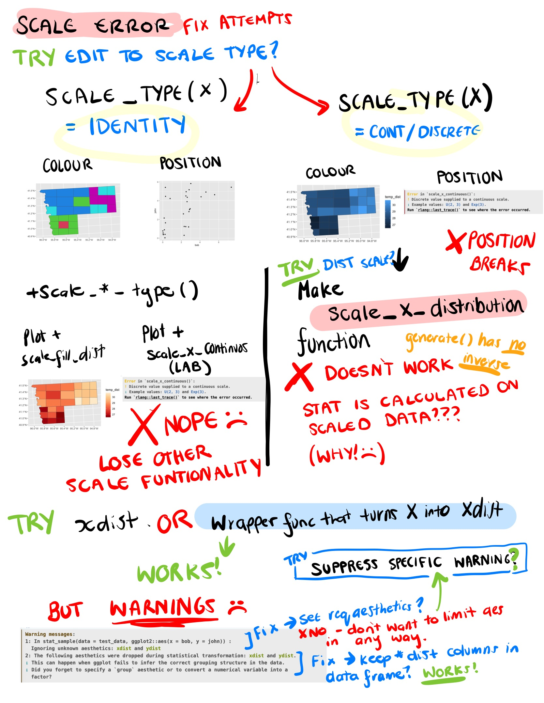{fig-align="center"}

## Asking for help 
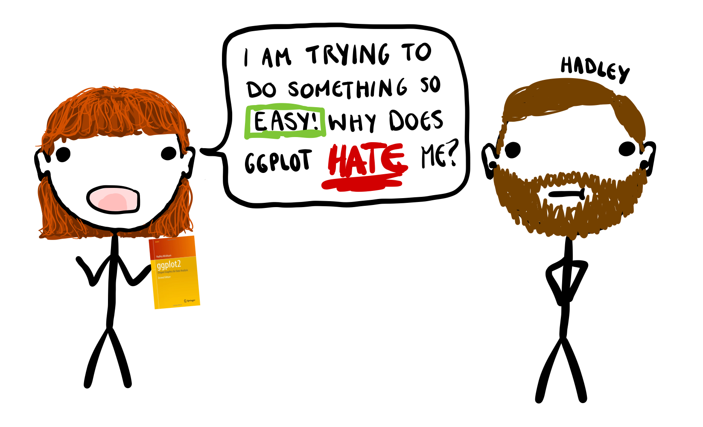{fig-align="center"}

## Asking for help 
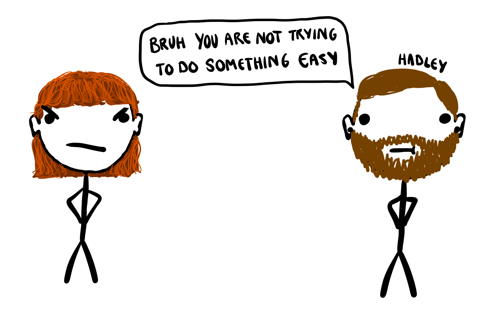{fig-align="center"}

## Asking for help 
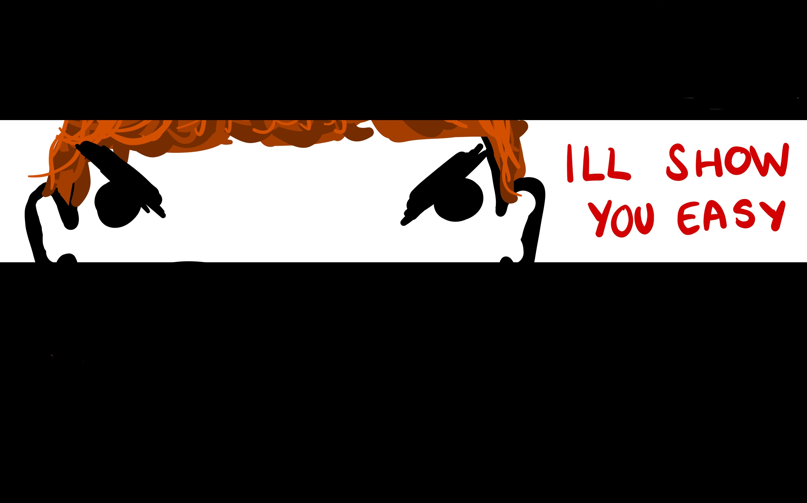{fig-align="center"}


# Part 4: A State of Mainia and `ggdibbler`

## Mania in the Github activity
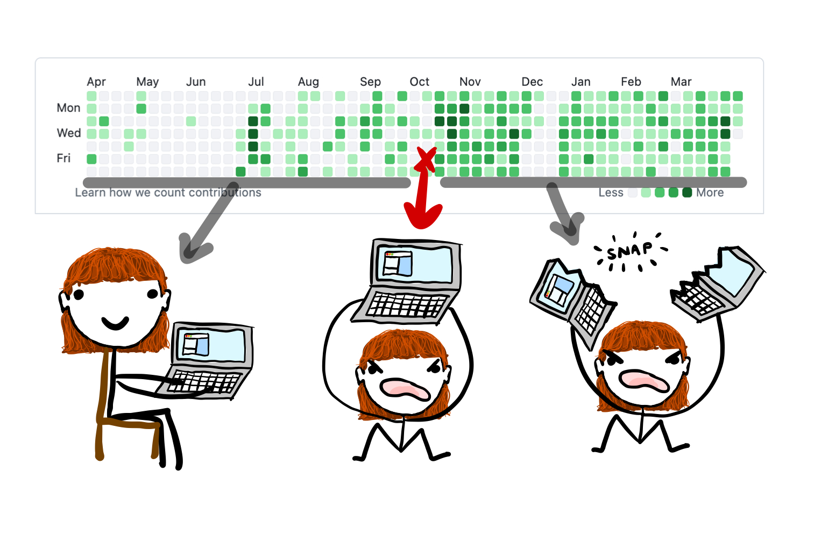{fig-align="center"}

## Spatial Plots  {.smaller}

```{r spatialdata}
#| echo: false
# Make average summary of data
toy_temp_mean <- toy_temp |> 
  dplyr::group_by(county_name) |>
  summarise(temp_mean = mean(recorded_temp))
```

::::: columns
::: {.column width="50%"}

```{r}
#| echo: true
#| fig-width: 4
ggplot(toy_temp_mean) +
  geom_sf(aes(geometry=county_geometry, fill=temp_mean), linewidth=0.7) +
  scale_fill_distiller(palette = "OrRd") +
  labs(fill="temp")+
  ggtitle("ggplot2")+
  theme(legend.position = "bottom")

```

:::

::: {.column width="50%"}

```{r}
#| echo: true
#| fig-width: 4

toy_temp_dist |> 
  ggplot() + 
  geom_sf_sample(aes(geometry = county_geometry, fill=temp_dist), linewidth=0, times=50) + 
  geom_sf(aes(geometry = county_geometry), fill=NA, linewidth=0.7) +
  scale_fill_distiller(palette = "OrRd") +
  labs(fill="temp")+
  ggtitle("ggdibbler")+
  theme(legend.position = "bottom")
```

:::
:::::


## Contour plots

::::: columns
::: {.column width="50%"}

```{r}
#| echo: true
#| fig-width: 4
ggplot(faithfuld, aes(waiting, eruptions, z = density)) + 
  ggtitle("ggplot2") +
  geom_contour() +
  theme(aspect.ratio = 1)

```

:::

::: {.column width="50%"}

```{r}
#| echo: true
#| fig-width: 4

ggplot(uncertain_faithfuld, aes(waiting, eruptions, z = density2))+
  ggtitle("ggdibbler") +
  geom_contour_sample(alpha=0.2)+
  theme(aspect.ratio = 1)

```

:::
:::::

## Text plots {.smaller}

```{r textdata}
#| echo: false
set.seed(10)
textdata <- expand_grid(x = c(1,2,3,4,5), y= c(1,2,3,4,5)) |>
  mutate(
    text_const = sample(c(TRUE, FALSE), 25, replace=TRUE),
    text_dist = dist_bernoulli(0.3 + 0.4*text_const),
    ) 
```

::::: columns
::: {.column width="50%"}

```{r}
#| echo: true
#| fig-width: 4
ggplot(textdata, aes(x=x, y=y)) +
  geom_text(aes(label = text_const), size=4) +
  theme_few() +
  ggtitle("ggplot2") +
  theme(aspect.ratio = 1, legend.position = "none") 

```

:::

::: {.column width="50%"}

```{r}
#| echo: true
#| fig-width: 4

ggplot(textdata, aes(x=x, y=y, lab = text_dist)) +
  geom_text_sample(aes(label = after_stat(lab)), 
                   size=4, alpha=1/30, times=30) +
  ggtitle("ggdibbler") +
  theme_few() +
  theme(aspect.ratio = 1, legend.position = "none") 

```

:::
:::::


## Raster Plots  {.smaller}

::::: columns
::: {.column width="50%"}

```{r}
#| echo: true
#| fig-width: 4
ggplot(faithfuld, aes(waiting, eruptions)) + 
  geom_raster(aes(fill = density)) +
  ggtitle("ggplot2")+
  theme(legend.position = "bottom")

```

:::

::: {.column width="50%"}

```{r}
#| echo: true
#| fig-width: 4

ggplot(uncertain_faithfuld, aes(waiting, eruptions)) + 
  geom_raster_sample(aes(fill = density2)) +
  ggtitle("ggdibbler more error")+
  theme(legend.position = "bottom")

```

:::
:::::

## Positioning breaks the system?

```{r dodgebarchart, fig.width=12, fig.height=4}

set.seed(10)
catdog <- tibble(
    DogOwner = sample(c(TRUE, FALSE), 25, replace=TRUE),
    CatOwner = sample(c(TRUE, FALSE), 25, replace=TRUE))

random_catdog <- catdog |>
  mutate(
    DogOwner = dist_bernoulli(0.1 + 0.8*DogOwner),
  )
    

p1 <- ggplot(catdog, aes(DogOwner)) + 
  geom_bar_sample(aes(fill = CatOwner), 
                  position = position_dodge(preserve="single"))+
  theme_few() +
  theme(legend.position="none", aspect.ratio = 1)+
  ggtitle("ggplot: dodge")


p2 <- ggplot(random_catdog, aes(DogOwner)) + 
  geom_bar_sample(aes(fill = CatOwner), times=30,
                  position = "dodge_dodge") +
  theme_few() +
  theme(legend.position="none", aspect.ratio = 1)+
  ggtitle("ggdibbler: dodge_dodge")

p3 <- ggplot(random_catdog, aes(DogOwner)) + 
  geom_bar_sample(aes(fill = CatOwner),  times=30,
                  position = position_dodge(preserve="single")) +
  theme_few() +
  theme(legend.position="none", aspect.ratio = 1)+
  ggtitle("ggdibbler: dodge")

p3 <- ggplot(random_catdog, aes(DogOwner)) + 
  geom_bar_sample(aes(fill = CatOwner),  times=30,
                  position = position_dodge(preserve="single")) +
  theme_few() +
  theme(legend.position="none", aspect.ratio = 1)+
  ggtitle("ggdibbler: dodge")

p1 | p3 | p2

```

## Nested positioning
- Allows you to manage the overplotting from the sample

```{r}
# ggplot IDENTITY
p1 <- ggplot(mpg, aes(class)) + 
  geom_bar_sample(aes(fill = drv), 
                  position = "identity", alpha=0.7)+
  theme_few() +
  theme(legend.position="none", aspect.ratio = 1) +
  ggtitle("ggplot2: identity")

# ggdibbler identity
p2 <- ggplot(uncertain_mpg, aes(class)) + 
  geom_bar_sample(aes(fill = drv), alpha=0.1,
                  position = "identity_identity")+
  theme_few() +
  theme(legend.position="none", aspect.ratio = 1)+
  ggtitle("identity_identity")

p3 <- ggplot(uncertain_mpg, aes(class)) + 
  geom_bar_sample(aes(fill = drv), alpha=0.7,
                  position = "identity_dodge")+
  theme_few() +
  theme(legend.position="none", aspect.ratio = 1)+
  ggtitle("identity_dodge")


# ggplot dodge
p5 <- ggplot(mpg, aes(class)) + 
  geom_bar_sample(aes(fill = drv), 
                  position = position_dodge(preserve="single"))+
  theme_few() +
  theme(legend.position="none", aspect.ratio = 1)+
  ggtitle("ggplot: dodge")

p6 <- ggplot(uncertain_mpg, aes(class)) + 
  geom_bar_sample(aes(fill = drv), alpha=0.1,
                  position = "dodge_identity")+
  theme_few() +
  theme(legend.position="none", aspect.ratio = 1)+
  ggtitle("dodge_identity")

p7 <- ggplot(uncertain_mpg, aes(class)) + 
  geom_bar_sample(aes(fill = drv), 
                  position = "dodge_dodge")+
  theme_few() +
  theme(legend.position="none", aspect.ratio = 1)+
  ggtitle("dodge_dodge")


# ggplot stack
p9 <- ggplot(mpg, aes(class)) + 
  geom_bar_sample(aes(fill = drv), 
                  position = "stack")+
  theme_few() +
  theme(legend.position="none", aspect.ratio = 1)+
  ggtitle("ggplot2: stack")


p10 <- ggplot(uncertain_mpg, aes(class)) + 
  geom_bar_sample(aes(fill = drv), alpha=0.1,
                  position = "stack_identity")+
  theme_few() +
  theme(legend.position="none", aspect.ratio = 1)+
  ggtitle("stack_identity")

p11 <- ggplot(uncertain_mpg, aes(class)) + 
  geom_bar_sample(aes(fill = drv),
                  position = "stack_dodge")+
  theme_few() +
  theme(legend.position="none", aspect.ratio = 1)+
  ggtitle("stack_dodge")


(p1 | p2 | p3 ) / (p5 | p6 | p7) / (p9 | p10 | p11)

```


## Bar charts  {.smaller}

::::: columns
::: {.column width="50%"}

```{r}
#| echo: true
#| fig-width: 4
ggplot(mpg, aes(class)) + 
  geom_bar_sample(aes(fill = drv), 
                  position = "stack")+
  theme(legend.position="none")+
  ggtitle("stack")

```

:::

::: {.column width="50%"}

```{r}
#| echo: true
#| fig-width: 4

ggplot(uncertain_mpg, aes(class)) + 
  geom_bar_sample(aes(fill = drv),
                  position = "stack_dodge")+
  theme(legend.position="none")+
  ggtitle("stack_dodge")

```

:::
:::::

## Also, replicate all the data sets
Every data set used in the `ggplot2` documentation has a `distributional` version in `ggdibbler`

- `diamonds` = `uncertain_diamonds`
- `mpg` = `uncertain_mpg`
- `mtcars` = `uncertain_mtcars`
- `faithful` = `uncertain_faithful`
- `economics`= `uncertain_economics`

## Replicate all the documentation

::::: columns
::: {.column width="50%"}
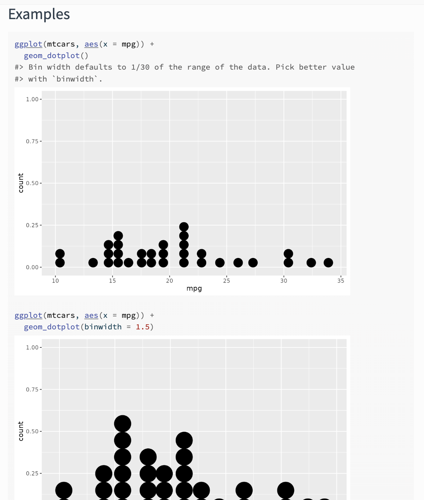{fig-align="center"}
:::

::: {.column width="50%"}

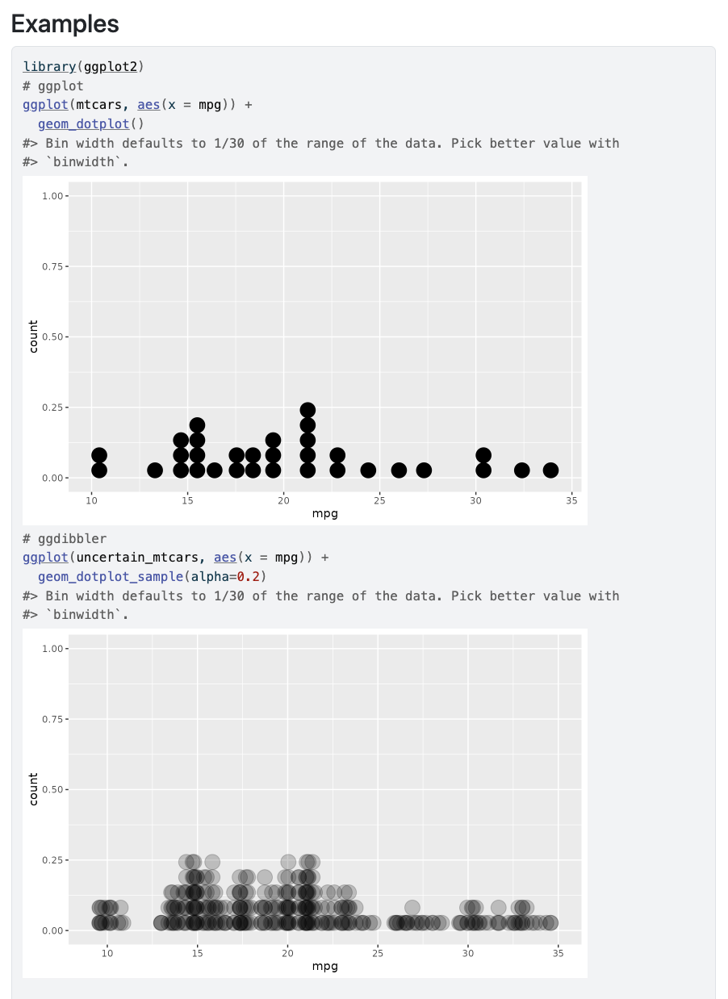{fig-align="center"}

:::
:::::

## ggdibbler and ggplot2

- Every `geom` has a `geom_sample` counterpart...

::::: columns
::: {.column width="50%"}

```{=html}
<iframe width="780" height="500" src="https://ggplot2.tidyverse.org/reference/index.html#geoms" title="ggplot2"></iframe>
```

:::

::: {.column width="50%"}

```{=html}
<iframe width="780" height="500" src="https://harriet-mason.github.io/ggdibbler/reference/index.html#geoms" title="ggdibbler"></iframe>
```

:::
:::::


## Combine all this together to get...

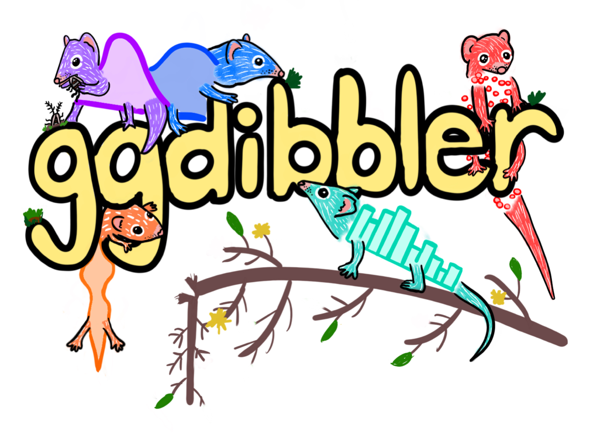{fig-align="center"}

## Universal application in `ggdibbler` {.smaller}

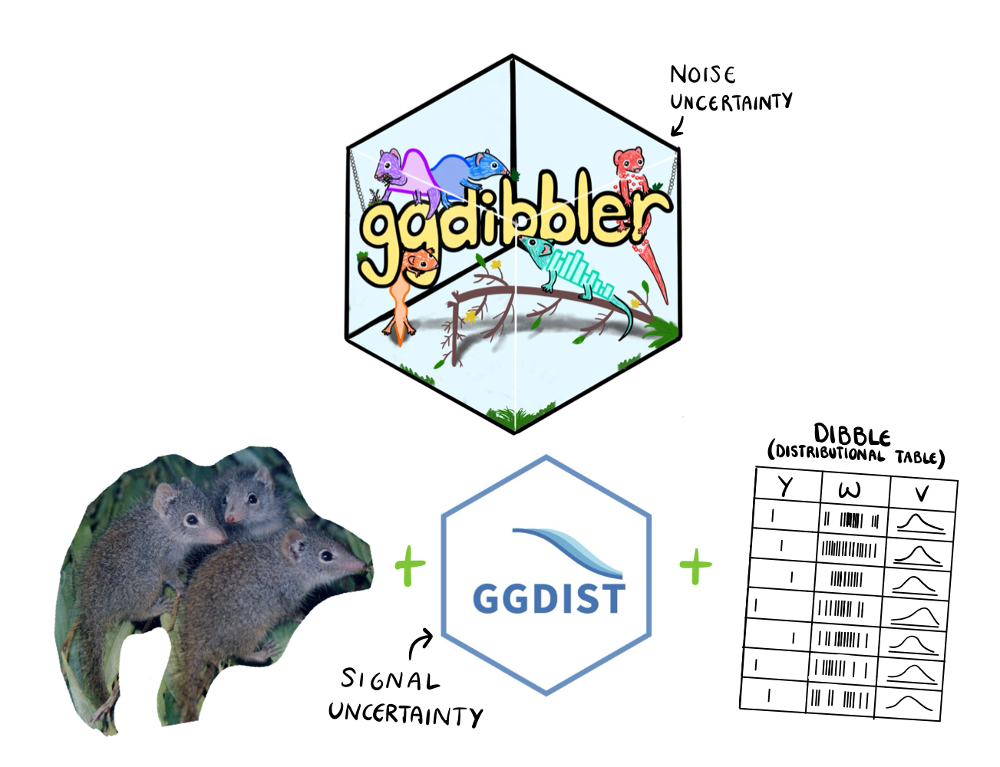{fig-align="center"}


## Back to walktober example

```{r}
# Plot0B
p3 <- ggplot(my_suburbs) +
  geom_sf_sample(data = suburb_walk, linewidth=0, times=100,
                 aes(geometry= geometry, fill = steps_dist)) +
  geom_sf(aes(geometry= geometry), fill=NA) +
  theme_map()  +
  ggtitle("Average steps per day by Melbourne Suburb") + 
  labs(fill = "Average steps per day") +
  scale_fill_continuous_sequential(palette = "Magenta", rev = TRUE)

# plot 3B
p4 <- ggplot(clean_walk, aes(x=team, y = steps_dist, fill = team_colour)) +
  geom_col_sample(times=50) +
  scale_fill_identity() +
  ggtitle("Total steps per team, per person") +
  theme_few()

p3 + p4
```

# Chapter 5: Conlcusions

## Future Plans

-   Future of the software
    -   multivariate distributions and other complex more complex joint distributions
    -   built out nested position system
    -   expand on the scales to accept more object types
-   Unemployment
    -   I also need a job (I am holding my software hostage)
    -   If you want to give me a job, my email is harriet.m.mason\@gmail.com

## Acknowledgements
-   My Supervisors: Di Cook, Susan Vanderplas, and Sarah Goodwin
-   Experiment Co-authors: Rachel Rogers and Alison Kleffner
-   AEMO Zema Energy Schoalarship
-   Australian RTP Stipend
-   Numbat Hackathon (for the walktober data)
-   Mitch O'Hara-Wild and Cynthia Huang
