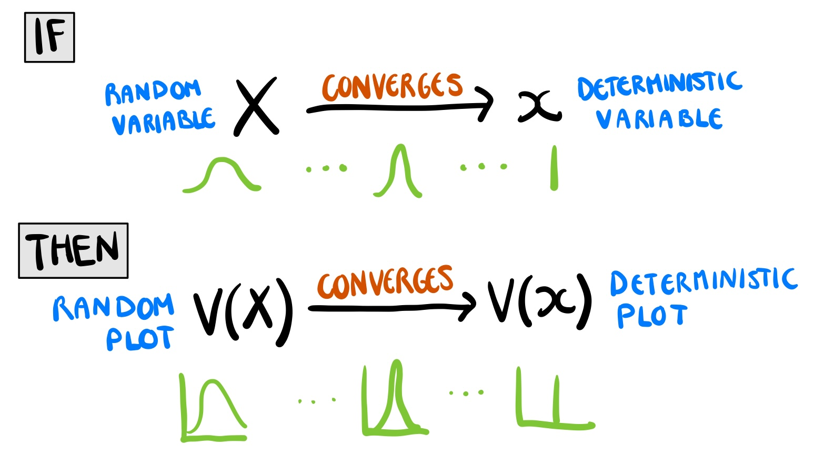
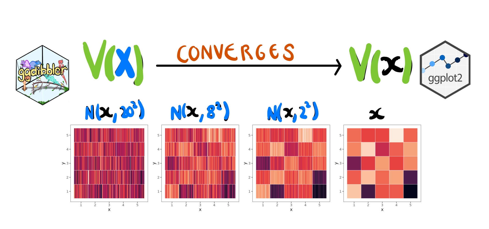
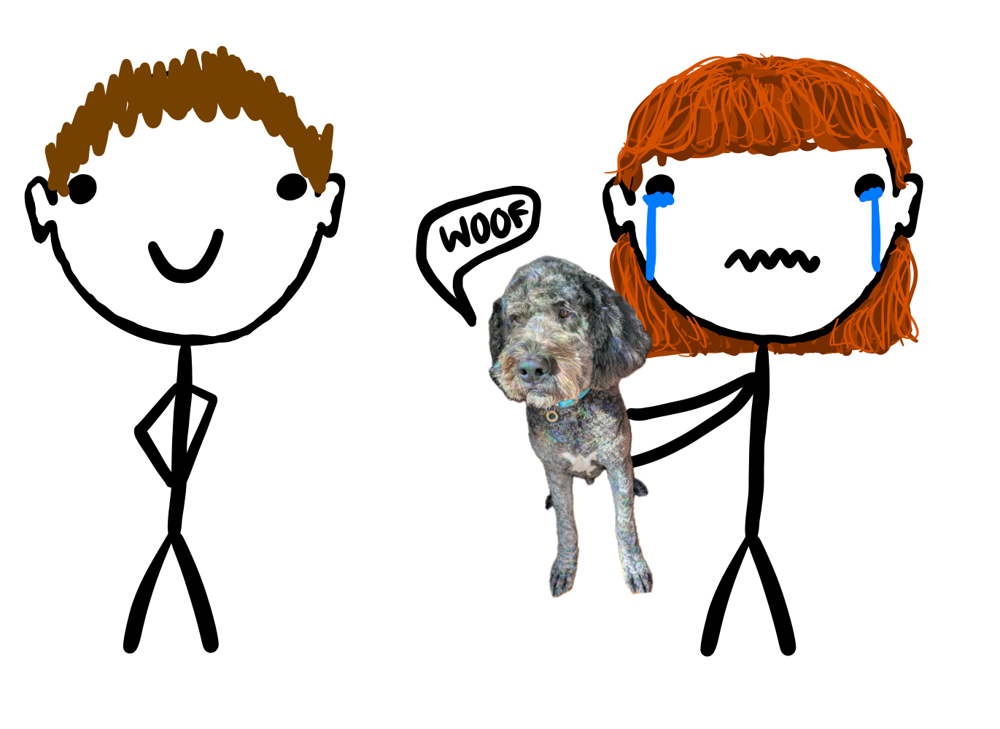
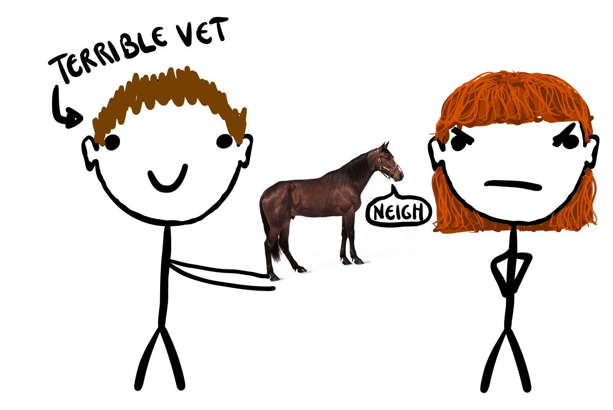
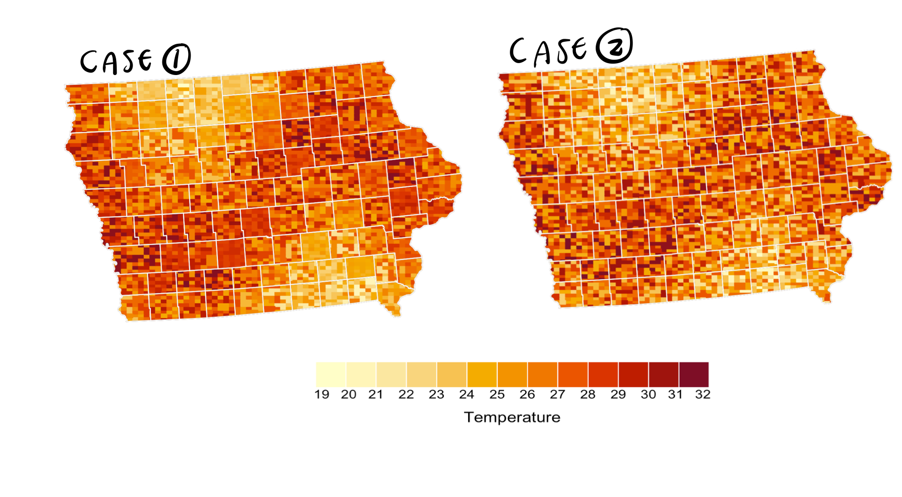
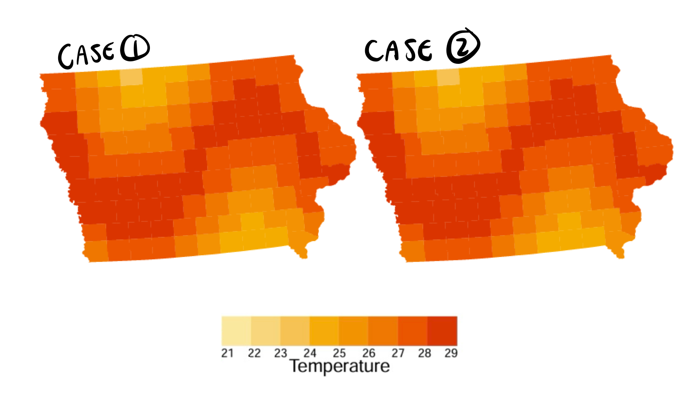
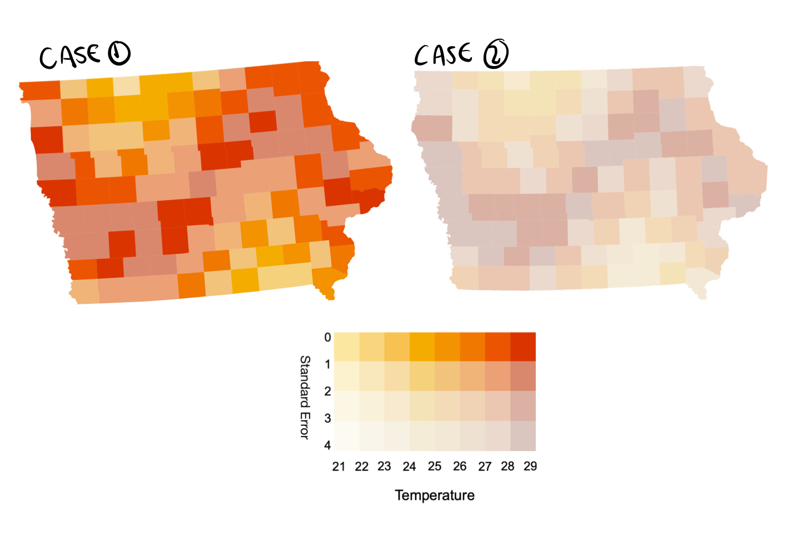
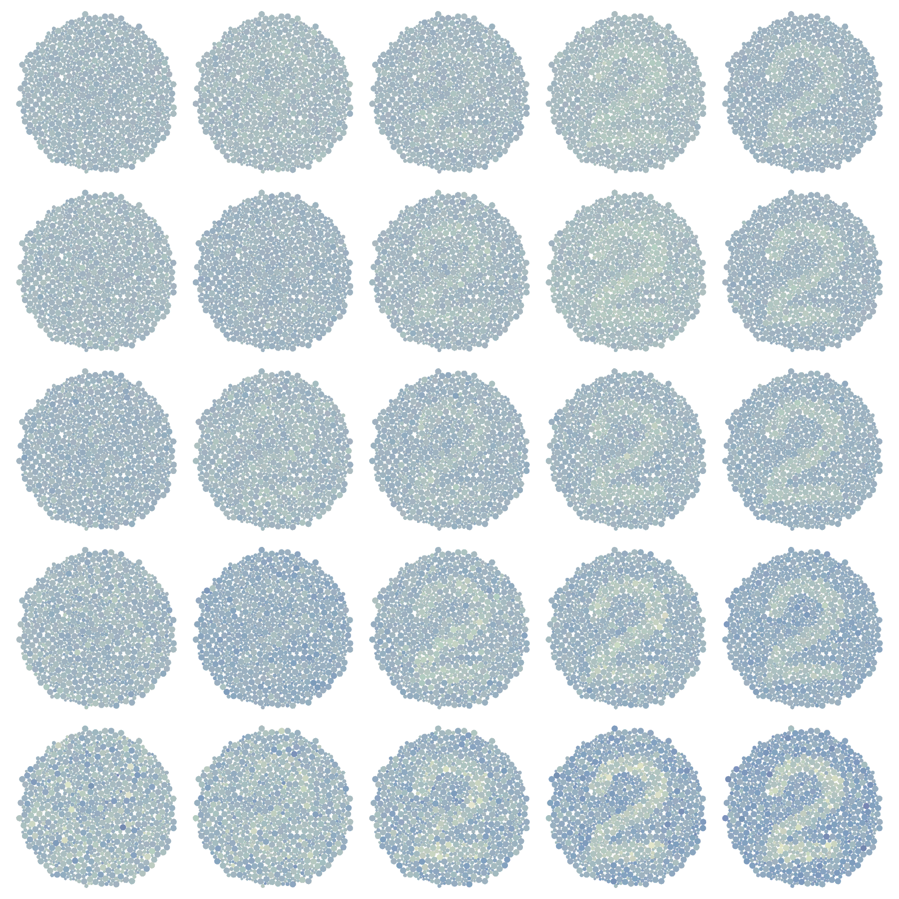

## How many statisticans does it take to visualise a random variable {.smaller}

-   Even though we usually work with random variables, are unable to visualise them effectively
-   Our choice of error distribution might change the conclusion of our analysis in unexpected ways
-   Often our solution is to just ignore the inherrent uncertainty in our data


## Theory - Visual Continuous Mapping Theorem

{fig-align="center"}

## Syntax of Continuous mapping theorem

{fig-align="center"}


## Practical - Code
- Continuous mapping theorem implies the function is the same
- Therefore: `ggplot2` code = `ggdibbler` code
- Only difference is the random variable input

## Speaking of random variable inputs {.smaller}

::::: columns
::: {.column width="70%"}
```{r}
clean_walk|> 
  as_tibble() |>
  select(steps_dist, team, name) |>
  head(8) 
```
:::

::: {.column width="30%"}
-   Vectorised random variables with `distributional`
-   Our walktober example can be represented by truncated normally distributed random variables
-   This is not a talk on `distributional` (but you should look at the software, it is neat)

:::
:::::


## Exceedance probability map
```{r}
exceed1 + ggtitle("Low Variance") + exceed2  + ggtitle("High Variance")
```


## A terrible vet

{fig-align="center"}

## A terrible vet

{fig-align="center"}

## Uncertainty as signal vs noise {.smaller}

-   Uncertainty can play two roles in an analysis
    -   Sometimes it is used to hedge or dampen our conclusions on other statistics
    -   Sometimes it is a statistic of inference itself
-   A visualisation is a statistic which means, just like other statistics, we use them to draw inference
    -   If we want to draw inference on uncertainty: visualise uncertainty as signal
    -   If it is supposed to hedge our inference from the plot: it is noise
-   An exceedence probability map is fine if we want to draw inference on our uncertainty, but not fine if we were trying to hedge the original plot

## I keep getting scammed


::::: columns
::: {.column width="70%"}
{fig-align="center"}
:::

::: {.column width="30%"}
-   Made using Vizumap's pixelmap function
-   Gives the best overall understanding of our random variables
-   Not actually making any top level decisions, just letting the variance from the random variables carry through to the visual system
-   The signal seems harder to read
-   1D colour palette
:::
:::::
## Old map pictures
{fig-align="center"}
{fig-align="center"}


## Can I pick any position adjstment?
- Also checked different position adjustments in experiment

::: {#fig-plotexample layout-ncol=2}

{fig-align="center"}

{fig-align="center"}

(Thank you Nick Tierney for the `ishihara` package)
:::

## All `ggdibbler` plots convey the same statistical information!
```{r}
glmer_models |>
  filter(!D==0,
         plot_type %in% c("Choropleth", "Pixel", "Transparency")) |>
  mutate(line_id = interaction(plot_type, id)) |>
  ggplot(aes(x=V,  group = line_id)) +
  geom_line(aes(y = power_random, colour = plot_type), 
            linewidth=0.3, alpha=0.3) +
  geom_line(data = theoretical_models |>
              filter(!D==0, plot_type %in% c("Choropleth", "Pixel", "Transparency")) |>
              mutate(line_id = interaction(test, plot_type, correct_number)),
            aes(y=power_random, linetype = test),
            linewidth=0.3, colour = "black") +
  theme(legend.position="top", 
        legend.direction ="horizontal",
        text=element_text(size=10), 
        strip.text.x=element_text(size=8),
        strip.text.y=element_text(size=8),
        legend.text = element_text(size=8)) +
  guides(colour = "none") + 
  facet_grid(rows = vars(plot_type), cols = vars(D),
             labeller = labeller(D = name_distance)) +
  labs(x = "Standard Deviation", y = "Power",
       linetype = "Classical Test") +
  scale_linetype_manual(values = LINES) 

```

## ggdibbler and ggplot2

- Every `geom` has a `geom_sample` counterpart...

::::: columns
::: {.column width="50%"}

```{=html}
<iframe width="780" height="500" src="https://ggplot2.tidyverse.org/reference/index.html#geoms" title="ggplot2"></iframe>
```

:::

::: {.column width="50%"}

```{=html}
<iframe width="780" height="500" src="https://harriet-mason.github.io/ggdibbler/reference/index.html#geoms" title="ggdibbler"></iframe>
```

:::
:::::


## Quantifiable vs unquantifiable uncertainty {.smaller}

-   I can incorporate pedometer error estimates into our analysis, I *CANNOT* work with completely falsified data
-   This is the difference between quantifiable vs unquantifiable uncertainty
-   We are going to try and quantify the uncertainty that we can quantify
    -   "Anything worth doing is worth doing poorly" - G. K. Chesterton

